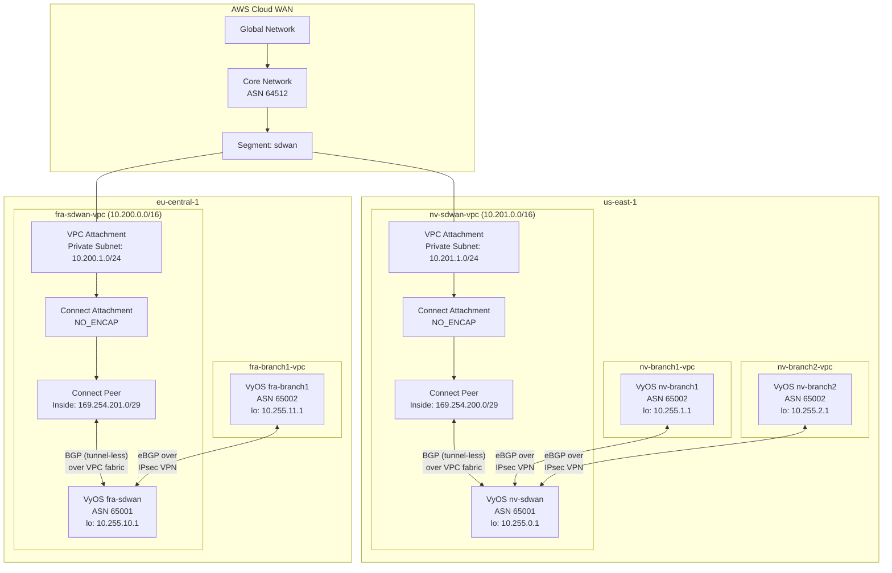
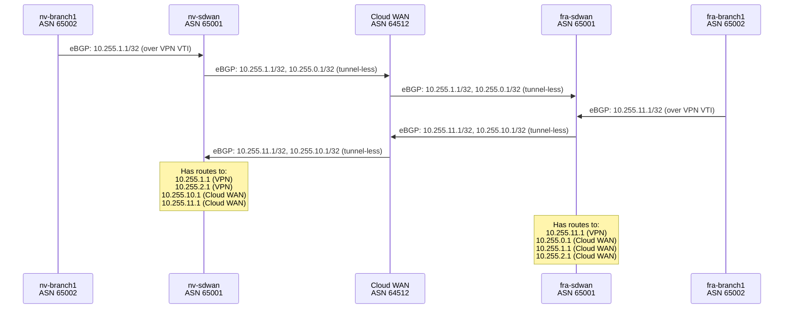
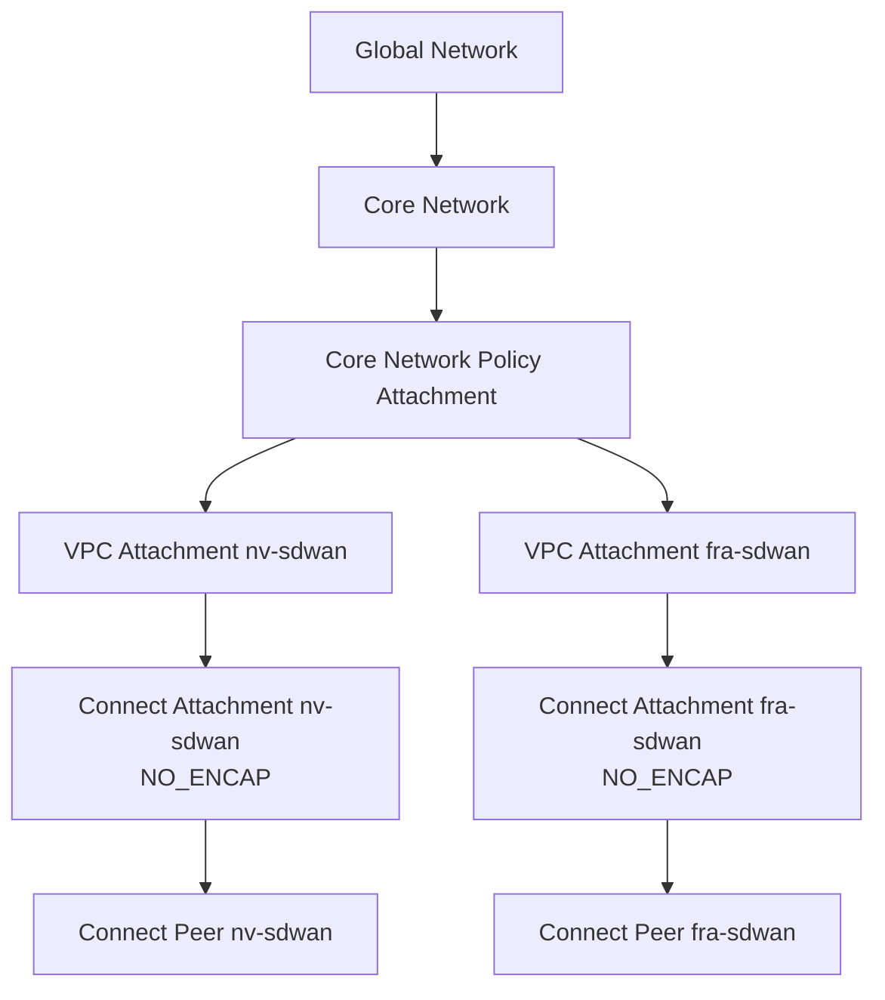

# Design Document: Cloud WAN SD-WAN BGP Integration (Tunnel-less)

## Overview

This design adds AWS Cloud WAN as a global backbone connecting the two SDWAN VPCs (nv-sdwan-vpc in us-east-1 and fra-sdwan-vpc in eu-central-1) using tunnel-less Connect attachments for BGP peering. The approach avoids GRE encapsulation — BGP sessions run directly over the VPC fabric between the VyOS SDWAN routers and Cloud WAN Connect peers.

The implementation has two layers:
1. **Terraform infrastructure** — A new `cloudwan.tf` file defining the global network, core network with policy, VPC attachments, Connect attachments (NO_ENCAP protocol), and Connect peers. New variables in `variables.tf`, outputs in `outputs.tf`, and security group updates in the instance files.
2. **VyOS configuration script** — A new `phase4-cloudwan-bgp-config.sh` bash script that uses SSM Run Command to push BGP configuration to the nv-sdwan and fra-sdwan VyOS routers, adding Cloud WAN as an additional BGP neighbor alongside the existing VPN BGP sessions.

The existing VPN tunnels and BGP sessions between SDWAN and branch routers are untouched. Cloud WAN learns branch loopback routes from the SDWAN routers and propagates them across regions via the sdwan segment.

## Architecture



### Route Propagation Flow



## Components and Interfaces

### Component 1: Terraform Cloud WAN Resources (`cloudwan.tf`)

A new file `cloudwan.tf` in the project root containing all Cloud WAN resources. This keeps the Cloud WAN layer cleanly separated from existing VPC and instance definitions.

**Resources created:**

| Resource | Type | Provider | Purpose |
|----------|------|----------|---------|
| `aws_networkmanager_global_network.main` | Global Network | virginia (us-east-1) | Top-level container |
| `aws_networkmanager_core_network.main` | Core Network | virginia (us-east-1) | Multi-region backbone |
| `aws_networkmanager_core_network_policy_attachment.main` | Policy Attachment | virginia (us-east-1) | Applies the core network policy |
| `aws_networkmanager_vpc_attachment.nv_sdwan` | VPC Attachment | virginia | Attaches nv-sdwan-vpc |
| `aws_networkmanager_vpc_attachment.fra_sdwan` | VPC Attachment | frankfurt | Attaches fra-sdwan-vpc |
| `aws_networkmanager_connect_attachment.nv_sdwan` | Connect Attachment | virginia | NO_ENCAP connect for nv-sdwan |
| `aws_networkmanager_connect_attachment.fra_sdwan` | Connect Attachment | frankfurt | NO_ENCAP connect for fra-sdwan |
| `aws_networkmanager_connect_peer.nv_sdwan` | Connect Peer | virginia | BGP peer config for nv-sdwan |
| `aws_networkmanager_connect_peer.fra_sdwan` | Connect Peer | frankfurt | BGP peer config for fra-sdwan |

**Core Network Policy structure:**

```json
{
  "version": "2021.12",
  "core-network-configuration": {
    "vpn-ecmp-support": false,
    "asn-ranges": ["64512-65534"],
    "inside-cidr-blocks": [],
    "edge-locations": [
      { "location": "us-east-1", "asn": 64512 },
      { "location": "eu-central-1", "asn": 64512 }
    ]
  },
  "segments": [
    {
      "name": "sdwan",
      "require-attachment-acceptance": false,
      "edge-locations": ["us-east-1", "eu-central-1"]
    }
  ],
  "segment-actions": [
    {
      "action": "create-route",
      "segment": "sdwan",
      "destination-cidr-blocks": ["0.0.0.0/0"],
      "destinations": ["attachment-id"]
    }
  ],
  "attachment-policies": [
    {
      "rule-number": 100,
      "condition-logic": "or",
      "conditions": [
        { "type": "tag-value", "operator": "equals", "key": "segment", "value": "sdwan" }
      ],
      "action": { "association-method": "tag", "tag-value-of-key": "segment" }
    }
  ]
}
```

**Connect Attachment configuration:**

```hcl
resource "aws_networkmanager_connect_attachment" "nv_sdwan" {
  provider              = aws.virginia
  core_network_id       = aws_networkmanager_core_network.main.id
  transport_attachment_id = aws_networkmanager_vpc_attachment.nv_sdwan.id
  edge_location         = "us-east-1"
  options {
    protocol = "NO_ENCAP"
  }
  tags = {
    segment = var.cloudwan_segment_name
  }
}
```

**Connect Peer configuration:**

```hcl
resource "aws_networkmanager_connect_peer" "nv_sdwan" {
  provider              = aws.virginia
  connect_attachment_id = aws_networkmanager_connect_attachment.nv_sdwan.id
  peer_address          = aws_network_interface.nv_sdwan_sdwan_internal.private_ip
  bgp_options {
    peer_asn = var.sdwan_bgp_asn
  }
  inside_cidr_blocks = [var.cloudwan_connect_cidr_nv]
  subnet_arn         = module.nv_sdwan_vpc.private_subnet_arns[0]
}
```

The Connect Peer's `inside_cidr_blocks` is a /29 block. Cloud WAN assigns the first usable IP to the core network side and the second usable IP to the appliance side. For `169.254.200.0/29`:
- Cloud WAN peer: 169.254.200.1
- VyOS appliance: 169.254.200.2

### Component 2: Security Group Updates

Add BGP (TCP 179) ingress rules to the existing private security groups for nv-sdwan and fra-sdwan VPCs. The existing RFC1918 ingress rule (`10.0.0.0/8`) already covers the Inside_CIDR ranges (169.254.x.x), but since 169.254.x.x is link-local and not within 10.0.0.0/8, we need explicit rules.

```hcl
# Added to nv_sdwan_private_sg
ingress {
  description = "BGP from Cloud WAN Connect Peer"
  from_port   = 179
  to_port     = 179
  protocol    = "tcp"
  cidr_blocks = [var.cloudwan_connect_cidr_nv]
}

# Added to fra_sdwan_private_sg
ingress {
  description = "BGP from Cloud WAN Connect Peer"
  from_port   = 179
  to_port     = 179
  protocol    = "tcp"
  cidr_blocks = [var.cloudwan_connect_cidr_fra]
}
```

Additionally, allow all traffic from the Inside CIDR ranges since Cloud WAN may use various protocols for health checks:

```hcl
ingress {
  description = "All from Cloud WAN Connect CIDR"
  from_port   = 0
  to_port     = 0
  protocol    = "-1"
  cidr_blocks = [var.cloudwan_connect_cidr_nv]
}
```

### Component 3: Terraform Variables (`variables.tf`)

New variables added:

```hcl
variable "cloudwan_asn" {
  description = "BGP ASN for Cloud WAN Core Network"
  type        = number
  default     = 64512
}

variable "cloudwan_connect_cidr_nv" {
  description = "Inside CIDR for nv-sdwan Connect Peer (/29)"
  type        = string
  default     = "169.254.200.0/29"
}

variable "cloudwan_connect_cidr_fra" {
  description = "Inside CIDR for fra-sdwan Connect Peer (/29)"
  type        = string
  default     = "169.254.201.0/29"
}

variable "cloudwan_segment_name" {
  description = "Cloud WAN segment name for SDWAN attachments"
  type        = string
  default     = "sdwan"
}
```

### Component 4: Terraform Outputs (`outputs.tf`)

New outputs added:

```hcl
output "cloudwan_core_network_id" {
  value = aws_networkmanager_core_network.main.id
}

output "cloudwan_core_network_arn" {
  value = aws_networkmanager_core_network.main.arn
}

output "cloudwan_nv_sdwan_vpc_attachment_id" {
  value = aws_networkmanager_vpc_attachment.nv_sdwan.id
}

output "cloudwan_fra_sdwan_vpc_attachment_id" {
  value = aws_networkmanager_vpc_attachment.fra_sdwan.id
}

output "cloudwan_nv_sdwan_connect_attachment_id" {
  value = aws_networkmanager_connect_attachment.nv_sdwan.id
}

output "cloudwan_fra_sdwan_connect_attachment_id" {
  value = aws_networkmanager_connect_attachment.fra_sdwan.id
}

output "cloudwan_nv_sdwan_connect_peer_config" {
  description = "Connect peer BGP configuration for nv-sdwan"
  value       = aws_networkmanager_connect_peer.nv_sdwan.configuration
}

output "cloudwan_fra_sdwan_connect_peer_config" {
  description = "Connect peer BGP configuration for fra-sdwan"
  value       = aws_networkmanager_connect_peer.fra_sdwan.configuration
}

output "cloudwan_asn" {
  value = var.cloudwan_asn
}
```

The `connect_peer.configuration` output contains the BGP peer details including:
- `core_network_address` — the Cloud WAN side IP for BGP peering
- `peer_address` — the appliance side IP
- `inside_cidr_blocks` — the /29 CIDR
- `bgp_configurations` — list of BGP session details with peer/core addresses

### Component 5: Phase 4 Configuration Script (`phase4-cloudwan-bgp-config.sh`)

A new bash script following the same pattern as `phase2-vpn-bgp-config.sh`. It reads Connect peer configuration from Terraform outputs and pushes VyOS BGP configuration to the SDWAN routers via SSM.

**Script structure:**

```bash
#!/bin/bash
set -euo pipefail

SDWAN_BGP_ASN=65001
CLOUDWAN_ASN=64512
SSM_TIMEOUT=300

# Instance-to-region mapping (only SDWAN routers)
declare -A INSTANCE_REGIONS
INSTANCE_REGIONS["nv-sdwan"]="us-east-1"
INSTANCE_REGIONS["fra-sdwan"]="eu-central-1"

# Read from terraform output
get_terraform_outputs() {
  # Instance IDs
  # Connect peer configurations (core_network_address, peer_address)
  # Private ENI IPs for SDWAN instances
}

# Generate vbash script for Cloud WAN BGP
build_cloudwan_bgp_script() {
  local router_name="$1"
  local cloudwan_peer_ip="$2"    # Core network side IP
  local appliance_ip="$3"        # Appliance side IP (from inside CIDR)
  local private_subnet_gw="$4"   # Private subnet gateway for static route
  
  cat <<VBASH
#!/bin/vbash
source /opt/vyatta/etc/functions/script-template
configure

# Dummy interface for Cloud WAN Connect peer inside address
set interfaces dummy dum0 address ${appliance_ip}/32

# Static route to Cloud WAN peer via private subnet gateway
set protocols static route ${cloudwan_peer_ip}/32 next-hop ${private_subnet_gw}

# BGP neighbor for Cloud WAN
set protocols bgp ${SDWAN_BGP_ASN} neighbor ${cloudwan_peer_ip} remote-as ${CLOUDWAN_ASN}
set protocols bgp ${SDWAN_BGP_ASN} neighbor ${cloudwan_peer_ip} update-source ${appliance_ip}
set protocols bgp ${SDWAN_BGP_ASN} neighbor ${cloudwan_peer_ip} ebgp-multihop 4
set protocols bgp ${SDWAN_BGP_ASN} neighbor ${cloudwan_peer_ip} address-family ipv4-unicast

commit
save
exit
VBASH
}

# Push config via SSM (same pattern as phase2)
push_config() { ... }

main() { ... }
```

**Key design decisions for VyOS tunnel-less BGP:**

1. **Dummy interface (dum0)**: Used to hold the Connect Peer inside address assigned to the appliance. This gives VyOS a local address to use as `update-source` for the BGP session. A dummy interface is preferred over a secondary loopback address to avoid conflicts with the existing `lo` loopback used for router-id.

2. **Static route to Cloud WAN peer**: Since the Cloud WAN peer IP (from the inside CIDR) is not directly on any VyOS interface subnet, a static route pointing to the private subnet default gateway ensures the VyOS router can reach the Cloud WAN peer over the VPC fabric. The private subnet gateway is the first IP in the subnet (e.g., 10.201.1.1 for nv-sdwan, 10.200.1.1 for fra-sdwan).

3. **ebgp-multihop**: Set to 4 to allow BGP packets to traverse the VPC fabric between the VyOS router and the Cloud WAN endpoint.

4. **Existing BGP preserved**: The script only adds new configuration (dummy interface, static route, BGP neighbor). It does not modify or delete any existing VPN BGP neighbors, VTI interfaces, or loopback configuration.

### Component 6: Phase 4 Verification Script (`phase4-cloudwan-verify.sh`)

A new verification script that checks Cloud WAN BGP integration status:

```bash
#!/bin/bash
set -euo pipefail

# For each SDWAN router:
# 1. show ip bgp summary — check Cloud WAN neighbor is Established
# 2. show ip route bgp — check cross-region loopback routes present
# 3. show interfaces dummy dum0 — check dummy interface is up
# 4. ping <cloudwan_peer_ip> — check reachability to Cloud WAN peer
# 5. show ip bgp neighbors <cloudwan_peer_ip> — detailed BGP session info
```

## Data Models

### Cloud WAN Resource Dependency Chain



### IP Address Assignments

| Resource | IP / CIDR | Purpose |
|----------|-----------|---------|
| nv-sdwan private ENI | 10.201.1.x (DHCP) | Connect Peer `peer_address` |
| fra-sdwan private ENI | 10.200.1.x (DHCP) | Connect Peer `peer_address` |
| nv-sdwan inside CIDR | 169.254.200.0/29 | Connect Peer BGP addressing |
| nv-sdwan Cloud WAN peer | 169.254.200.1 | BGP neighbor on VyOS |
| nv-sdwan appliance addr | 169.254.200.2 | VyOS dum0 interface + update-source |
| fra-sdwan inside CIDR | 169.254.201.0/29 | Connect Peer BGP addressing |
| fra-sdwan Cloud WAN peer | 169.254.201.1 | BGP neighbor on VyOS |
| fra-sdwan appliance addr | 169.254.201.2 | VyOS dum0 interface + update-source |
| nv-sdwan private GW | 10.201.1.1 | Static route next-hop |
| fra-sdwan private GW | 10.200.1.1 | Static route next-hop |

### BGP Session Summary (After Integration)

| Router | Neighbor | Remote ASN | Transport | Interface |
|--------|----------|------------|-----------|-----------|
| nv-sdwan | 169.254.100.2 (nv-branch1) | 65002 | IPsec VPN VTI | vti0 |
| nv-sdwan | 169.254.200.1 (Cloud WAN) | 64512 | Tunnel-less VPC fabric | dum0 |
| fra-sdwan | 169.254.100.14 (fra-branch1) | 65002 | IPsec VPN VTI | vti0 |
| fra-sdwan | 169.254.201.1 (Cloud WAN) | 64512 | Tunnel-less VPC fabric | dum0 |
| nv-branch1 | 169.254.100.1 (nv-sdwan) | 65001 | IPsec VPN VTI | vti0 |
| fra-branch1 | 169.254.100.13 (fra-sdwan) | 65001 | IPsec VPN VTI | vti0 |

### Terraform File Changes Summary

| File | Change Type | Description |
|------|-------------|-------------|
| `cloudwan.tf` | New | All Cloud WAN resources |
| `variables.tf` | Modified | Add 4 Cloud WAN variables |
| `outputs.tf` | Modified | Add Cloud WAN outputs |
| `instances-virginia.tf` | Modified | Add SG rules to nv_sdwan_private_sg |
| `instances-frankfurt.tf` | Modified | Add SG rules to fra_sdwan_private_sg |
| `phase4-cloudwan-bgp-config.sh` | New | SSM script for VyOS Cloud WAN BGP |
| `phase4-cloudwan-verify.sh` | New | Verification script |


## Correctness Properties

*A property is a characteristic or behavior that should hold true across all valid executions of a system — essentially, a formal statement about what the system should do. Properties serve as the bridge between human-readable specifications and machine-verifiable correctness guarantees.*

Since this feature is primarily Terraform infrastructure and bash scripts, the testable properties focus on the correctness of generated configuration payloads, tag consistency, and script behavior. Many acceptance criteria (especially Requirement 7 route propagation) are runtime integration concerns verified by the Phase 4 verification script rather than unit-testable properties.

### Property 1: Cloud WAN attachment segment tagging

*For any* Cloud WAN attachment (VPC attachment or Connect attachment) created by the Terraform configuration, the resource SHALL include a tag with key "segment" and value matching the configured segment name variable.

**Validates: Requirements 2.3, 3.3**

### Property 2: Connect peer ASN consistency

*For any* Connect Peer resource created by the Terraform configuration, the `peer_asn` in `bgp_options` SHALL equal the SDWAN BGP ASN (65001).

**Validates: Requirements 3.6**

### Property 3: VyOS tunnel-less connectivity setup

*For any* SDWAN router targeted by the configuration script, the generated vbash script SHALL contain: (a) a dummy interface (dum0) with the appliance's inside address from the Connect Peer CIDR, and (b) a static route for the Cloud WAN peer IP with next-hop set to the private subnet gateway.

**Validates: Requirements 5.1, 5.2**

### Property 4: VyOS BGP neighbor configuration correctness

*For any* SDWAN router targeted by the configuration script, the generated vbash script SHALL configure a BGP neighbor with: (a) the Cloud WAN peer IP as the neighbor address, (b) the Core Network ASN (64512) as remote-as, and (c) the appliance inside address as update-source.

**Validates: Requirements 5.3, 5.4, 5.5**

### Property 5: Existing BGP configuration preservation

*For any* SDWAN router targeted by the configuration script, the generated vbash script SHALL NOT contain any "delete" commands that would remove existing BGP neighbors, VTI interfaces, loopback addresses, or IPsec VPN configuration.

**Validates: Requirements 5.7**

### Property 6: Instance-to-region mapping correctness

*For any* SSM command issued by the configuration or verification scripts, the --region parameter SHALL be "us-east-1" for nv-sdwan and "eu-central-1" for fra-sdwan.

**Validates: Requirements 6.5, 9.6**

## Error Handling

### Terraform Apply Errors

| Error Condition | Handling Strategy |
|----------------|-------------------|
| Core Network not AVAILABLE | Use `depends_on` on VPC attachments to wait for policy attachment. Cloud WAN can take 5-15 minutes to provision. Terraform will poll automatically. |
| VPC Attachment creation fails | Verify the private subnet ID is correct and the VPC is in the same region as the edge location. Check that the core network policy includes the correct edge location. |
| Connect Attachment creation fails | Verify the VPC attachment is in AVAILABLE state. Connect attachments depend on VPC attachments being fully provisioned. |
| Connect Peer creation fails | Verify the inside CIDR doesn't overlap with existing CIDRs. Verify the peer_address (private ENI IP) is reachable from the VPC attachment subnet. |
| Policy attachment conflict | If the core network policy is modified outside Terraform, use `terraform import` or manually reconcile. |

### VyOS Configuration Errors

| Error Condition | Handling Strategy |
|----------------|-------------------|
| VyOS commit failure | The vbash script exits non-zero on commit failure. SSM reports failure. Check VyOS config syntax and re-run. |
| Dummy interface conflict | If dum0 already exists with a different address, VyOS will update it. The script is idempotent. |
| Static route conflict | If the static route already exists, VyOS "set" is idempotent and will not error. |
| BGP neighbor already exists | VyOS "set" for an existing neighbor updates the config. No error on re-run. |
| BGP session fails to establish | Check: (1) security group allows TCP 179 from inside CIDR, (2) static route to Cloud WAN peer is correct, (3) dummy interface has correct IP, (4) Cloud WAN Connect Peer is in AVAILABLE state. |

### SSM Execution Errors

| Error Condition | Handling Strategy |
|----------------|-------------------|
| Instance not registered with SSM | Script checks SSM registration before sending commands. Reports and skips if not registered. |
| Router container not running | Script checks `lxc info router` before pushing config. Reports and skips if not running. |
| SSM command timeout | Script uses configurable timeout (default 300s). Reports timeout and continues to next instance. |
| SSM command failure | Script captures stderr from SSM invocation. Reports failure with details and continues. |

## Testing Strategy

### Approach

This feature has two testable layers:
1. **Terraform configuration** — Validated via `terraform validate`, `terraform plan`, and inspection of the plan output
2. **Bash scripts** — The configuration generation logic (vbash script building) can be tested with property-based tests using Python/Hypothesis by extracting the script generation into testable functions

### Static Validation

- `terraform validate` — HCL syntax and resource reference correctness
- `terraform plan` — Resource graph, dependency ordering, and planned resource attributes
- `shellcheck phase4-cloudwan-bgp-config.sh phase4-cloudwan-verify.sh` — Bash syntax and common errors

### Property-Based Testing

The script generation logic (building vbash scripts from input parameters) is the primary target for property-based testing. Extract the `build_cloudwan_bgp_script` function logic into a testable Python module (similar to the existing `lambda/` pattern) and test with Hypothesis.

**Library**: Python `hypothesis` (already used in the project for `tests/test_phase2_properties.py`)

**Configuration**:
- Minimum 100 iterations per property test
- Each test tagged with: **Feature: cloudwan-sdwan-bgp-integration, Property {N}: {title}**

### Unit Tests

Unit tests cover specific examples and edge cases:
- Verify Terraform variable defaults match expected values
- Verify the core network policy JSON structure is valid
- Verify security group rules include TCP 179 for the correct CIDRs
- Verify Terraform outputs are defined for all required Cloud WAN resources

### Integration Testing (Phase 4 Verification)

The `phase4-cloudwan-verify.sh` script serves as the integration test suite, run after Terraform apply and Phase 4 configuration:
1. BGP session status with Cloud WAN (show ip bgp summary)
2. Cross-region route presence (show ip route bgp)
3. Existing VPN BGP sessions still established
4. Connect Peer reachability (ping)

### Test Execution Order

1. `shellcheck phase4-cloudwan-bgp-config.sh phase4-cloudwan-verify.sh`
2. `terraform validate` and `terraform plan`
3. `python -m pytest tests/test_phase4_properties.py` (property-based tests)
4. `terraform apply`
5. `./phase4-cloudwan-bgp-config.sh` (push VyOS config)
6. `./phase4-cloudwan-verify.sh` (integration verification)
