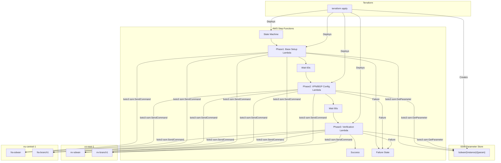
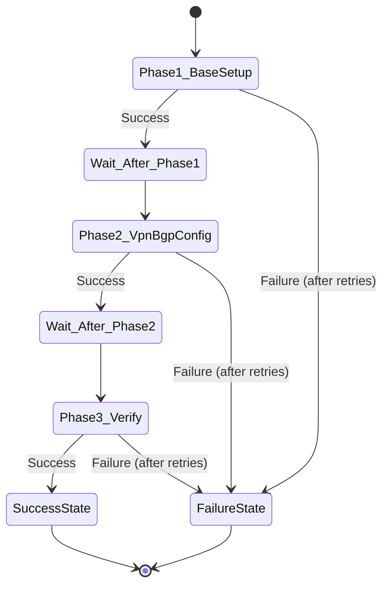
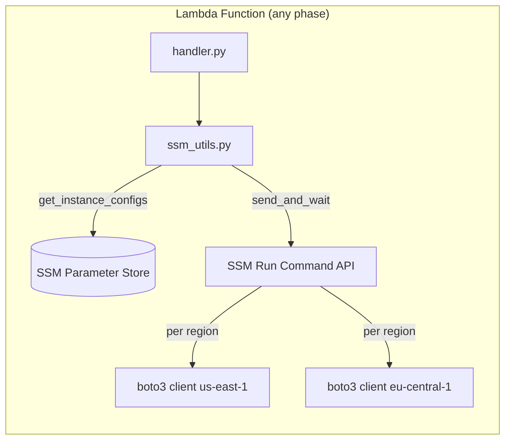

# Design Document: Lambda + Step Functions Orchestration

## Overview

This design replaces the local bash scripts (phase1-base-setup.sh, phase2-vpn-bgp-config.sh, phase3-verify.sh) with 3 Python Lambda functions orchestrated by an AWS Step Functions state machine. The Lambda functions use boto3 to replicate the SSM Run Command logic from the bash scripts, reading infrastructure parameters (instance IDs, EIPs, private IPs) from SSM Parameter Store at runtime. Terraform deploys all resources: Lambda functions, Step Functions state machine, IAM roles, and SSM parameters.

The key design decisions are:
- **Single Lambda per phase** rather than per-instance Lambdas, matching the existing script structure
- **SSM Parameter Store** as the bridge between Terraform outputs and Lambda runtime, avoiding hardcoded values
- **Shared ssm_utils.py module** to eliminate code duplication across the 3 Lambda functions
- **Regional boto3 clients** created per-instance since instances span us-east-1 and eu-central-1
- **Intra-region-only VPN topology**: nv-sdwan↔nv-branch1, fra-sdwan↔fra-branch1 (no cross-region tunnels)

## Architecture



### Step Functions State Machine Flow



### Lambda Internal Architecture



## Components and Interfaces

### 1. SSM Parameter Store (Terraform-managed)

Terraform creates SSM parameters from existing resource attributes. Parameters are created in the region where the instance lives.

| Parameter Path | Source | Region |
|---------------|--------|--------|
| `/sdwan/nv-sdwan/instance-id` | `aws_instance.nv_sdwan_sdwan_instance.id` | us-east-1 |
| `/sdwan/nv-sdwan/outside-eip` | `aws_eip.nv_sdwan_sdwan_outside_eip.public_ip` | us-east-1 |
| `/sdwan/nv-sdwan/outside-private-ip` | `aws_network_interface.nv_sdwan_sdwan_outside.private_ip` | us-east-1 |
| `/sdwan/nv-branch1/instance-id` | `aws_instance.nv_branch1_sdwan_instance.id` | us-east-1 |
| `/sdwan/nv-branch1/outside-eip` | `aws_eip.nv_branch1_sdwan_outside_eip.public_ip` | us-east-1 |
| `/sdwan/nv-branch1/outside-private-ip` | `aws_network_interface.nv_branch1_sdwan_outside.private_ip` | us-east-1 |
| `/sdwan/fra-sdwan/instance-id` | `aws_instance.fra_sdwan_sdwan_instance.id` | eu-central-1 |
| `/sdwan/fra-sdwan/outside-eip` | `aws_eip.fra_sdwan_sdwan_outside_eip.public_ip` | eu-central-1 |
| `/sdwan/fra-sdwan/outside-private-ip` | `aws_network_interface.fra_sdwan_sdwan_outside.private_ip` | eu-central-1 |
| `/sdwan/fra-branch1/instance-id` | `aws_instance.fra_branch1_sdwan_instance.id` | eu-central-1 |
| `/sdwan/fra-branch1/outside-eip` | `aws_eip.fra_branch1_sdwan_outside_eip.public_ip` | eu-central-1 |
| `/sdwan/fra-branch1/outside-private-ip` | `aws_network_interface.fra_branch1_sdwan_outside.private_ip` | eu-central-1 |

Terraform HCL pattern:
```hcl
resource "aws_ssm_parameter" "nv_sdwan_instance_id" {
  provider = aws.virginia
  name     = "/sdwan/nv-sdwan/instance-id"
  type     = "String"
  value    = aws_instance.nv_sdwan_sdwan_instance.id
}
```

### 2. Shared Utility Module — ssm_utils.py

This module provides two core functions used by all 3 Lambda handlers.

**`get_instance_configs(param_prefix, regions)`**:
- Creates boto3 SSM clients for each region
- Calls `ssm:GetParametersByPath` with prefix `/sdwan/` in each region
- Returns a dict keyed by instance name:
```python
{
    "nv-sdwan": {
        "instance_id": "i-xxx",
        "outside_eip": "1.2.3.4",
        "outside_private_ip": "10.201.2.x",
        "region": "us-east-1"
    },
    ...
}
```

**`send_and_wait(instance_id, region, commands, timeout=600)`**:
- Creates a regional boto3 SSM client
- Calls `ssm:SendCommand` with `AWS-RunShellScript` document
- Polls `ssm:GetCommandInvocation` every 15 seconds until Success, Failed, or timeout
- Returns a result dict:
```python
{
    "status": "Success" | "Failed" | "TimedOut",
    "command_id": "xxx",
    "instance_id": "i-xxx",
    "stdout": "...",
    "stderr": "..."
}
```

### 3. Phase1 Lambda — phase1_handler.py

Replicates `build_phase1_commands()` from phase1-base-setup.sh.

**Handler signature**: `def handler(event, context) -> dict`

**Logic**:
1. Call `get_instance_configs()` to load all 4 instance configs
2. Build the Phase1 shell command string (identical to the bash script's SSM payload)
3. For each instance, call `send_and_wait()` with the command payload
4. Return structured results:
```python
{
    "phase": "phase1",
    "results": {
        "nv-sdwan": {"status": "Success", ...},
        "nv-branch1": {"status": "Success", ...},
        ...
    },
    "success_count": 4,
    "fail_count": 0
}
```

**Key Phase1 command payload details** (matching existing script):
- `apt-get update && apt-get install -y python3-pip net-tools tmux curl unzip jq`
- `snap wait system seed.loaded` before snap installs
- `snap install lxd && snap install aws-cli --classic`
- LXD preseed with directory-backed "default" pool
- VyOS image download from S3 and import
- Router container: eth0→ens6, eth1→ens7, 1 CPU, 2048MiB
- Idempotency: `lxc stop router --force || true && lxc delete router || true`
- Base config.boot with DHCP on eth0/eth1
- Phase1 VyOS script: eth0 DHCP distance 10, eth1 DHCP no-default-route

### 4. Phase2 Lambda — phase2_handler.py

Replicates `build_vpn_bgp_script()` from phase2-vpn-bgp-config.sh.

**Handler signature**: `def handler(event, context) -> dict`

**Logic**:
1. Call `get_instance_configs()` to load all 4 instance configs
2. Define the tunnel topology and per-router config (loopback, ASN, VTI addresses)
3. For each router, generate a vbash script with the correct IPsec/BGP configuration
4. Wrap the vbash script in an SSM command that writes it to a file, pushes to the container, and executes
5. Call `send_and_wait()` for each instance
6. Return structured results

**Tunnel topology** (hardcoded in Lambda, matching existing scripts):

| Tunnel | Router A | VTI A | Router B | VTI B |
|--------|----------|-------|----------|-------|
| nv-sdwan ↔ nv-branch1 | nv-sdwan | vti0 169.254.100.1/30 | nv-branch1 | vti0 169.254.100.2/30 |
| fra-sdwan ↔ fra-branch1 | fra-sdwan | vti0 169.254.100.13/30 | fra-branch1 | vti0 169.254.100.14/30 |

**Per-router configuration**:

| Router | Loopback | ASN | Role |
|--------|----------|-----|------|
| nv-sdwan | 10.255.0.1/32 | 65001 | sdwan |
| nv-branch1 | 10.255.1.1/32 | 65002 | branch |
| fra-sdwan | 10.255.10.1/32 | 65001 | sdwan |
| fra-branch1 | 10.255.11.1/32 | 65002 | branch |

**IPsec configuration specifics** (matching existing phase2 script):
- `local-address`: router's outside private IP (not EIP)
- `peer address`: peer's outside EIP
- `authentication remote-id`: peer's outside private IP
- `encryption`: aes256 (not aes256gcm128) for both IKE and ESP proposals
- `hash`: sha256
- `ike-group`: ikev2, lifetime 28800, dh-group 14
- `esp-group`: lifetime 3600, tunnel mode, pfs dh-group14
- `connection-type`: initiate
- `vpn ipsec interface`: eth0

### 5. Phase3 Lambda — phase3_handler.py

Replicates `verify_instance()` from phase3-verify.sh.

**Handler signature**: `def handler(event, context) -> dict`

**Logic**:
1. Call `get_instance_configs()` to load all 4 instance configs
2. For each instance, run verification commands via SSM:
   - `show vpn ipsec sa`
   - `show ip bgp summary`
   - `show interfaces`
   - Ping tests to VTI peer addresses
3. Collect and return structured results

**VyOS command execution pattern**:
```
lxc exec router -- /opt/vyatta/bin/vyatta-op-cmd-wrapper show vpn ipsec sa
```

**Ping targets per router**:

| Router | Ping Target |
|--------|-------------|
| nv-sdwan | 169.254.100.2 |
| nv-branch1 | 169.254.100.1 |
| fra-sdwan | 169.254.100.14 |
| fra-branch1 | 169.254.100.13 |

### 6. Step Functions State Machine — ASL Definition

```json
{
  "Comment": "SD-WAN Configuration Orchestration",
  "StartAt": "Phase1_BaseSetup",
  "States": {
    "Phase1_BaseSetup": {
      "Type": "Task",
      "Resource": "arn:aws:lambda:us-east-1:ACCOUNT:function:sdwan-phase1",
      "Retry": [
        {
          "ErrorEquals": ["Lambda.ServiceException", "Lambda.AWSLambdaException", "Lambda.SdkClientException"],
          "IntervalSeconds": 30,
          "MaxAttempts": 2,
          "BackoffRate": 2.0
        }
      ],
      "Catch": [
        {
          "ErrorEquals": ["States.ALL"],
          "Next": "FailureState",
          "ResultPath": "$.error"
        }
      ],
      "ResultPath": "$.phase1_result",
      "Next": "Wait_After_Phase1"
    },
    "Wait_After_Phase1": {
      "Type": "Wait",
      "Seconds": 60,
      "Next": "Phase2_VpnBgpConfig"
    },
    "Phase2_VpnBgpConfig": {
      "Type": "Task",
      "Resource": "arn:aws:lambda:us-east-1:ACCOUNT:function:sdwan-phase2",
      "Retry": [
        {
          "ErrorEquals": ["Lambda.ServiceException", "Lambda.AWSLambdaException", "Lambda.SdkClientException"],
          "IntervalSeconds": 30,
          "MaxAttempts": 2,
          "BackoffRate": 2.0
        }
      ],
      "Catch": [
        {
          "ErrorEquals": ["States.ALL"],
          "Next": "FailureState",
          "ResultPath": "$.error"
        }
      ],
      "ResultPath": "$.phase2_result",
      "Next": "Wait_After_Phase2"
    },
    "Wait_After_Phase2": {
      "Type": "Wait",
      "Seconds": 90,
      "Next": "Phase3_Verify"
    },
    "Phase3_Verify": {
      "Type": "Task",
      "Resource": "arn:aws:lambda:us-east-1:ACCOUNT:function:sdwan-phase3",
      "Retry": [
        {
          "ErrorEquals": ["Lambda.ServiceException", "Lambda.AWSLambdaException", "Lambda.SdkClientException"],
          "IntervalSeconds": 30,
          "MaxAttempts": 2,
          "BackoffRate": 2.0
        }
      ],
      "Catch": [
        {
          "ErrorEquals": ["States.ALL"],
          "Next": "FailureState",
          "ResultPath": "$.error"
        }
      ],
      "ResultPath": "$.phase3_result",
      "Next": "SuccessState"
    },
    "SuccessState": {
      "Type": "Succeed"
    },
    "FailureState": {
      "Type": "Fail",
      "Cause": "Phase execution failed",
      "Error": "PhaseExecutionError"
    }
  }
}
```

### 7. IAM Roles

**Lambda Execution Role** (`sdwan-lambda-execution-role`):
```json
{
  "Version": "2012-10-17",
  "Statement": [
    {
      "Effect": "Allow",
      "Action": [
        "ssm:SendCommand"
      ],
      "Resource": [
        "arn:aws:ssm:*:*:document/AWS-RunShellScript",
        "arn:aws:ec2:*:*:instance/*"
      ]
    },
    {
      "Effect": "Allow",
      "Action": [
        "ssm:GetCommandInvocation",
        "ssm:DescribeInstanceInformation"
      ],
      "Resource": "*"
    },
    {
      "Effect": "Allow",
      "Action": "ssm:GetParameter",
      "Resource": "arn:aws:ssm:*:*:parameter/sdwan/*"
    },
    {
      "Effect": "Allow",
      "Action": "ssm:GetParametersByPath",
      "Resource": "arn:aws:ssm:*:*:parameter/sdwan"
    },
    {
      "Effect": "Allow",
      "Action": [
        "logs:CreateLogGroup",
        "logs:CreateLogStream",
        "logs:PutLogEvents"
      ],
      "Resource": "arn:aws:logs:*:*:*"
    }
  ]
}
```

**Step Functions Execution Role** (`sdwan-stepfunctions-role`):
```json
{
  "Version": "2012-10-17",
  "Statement": [
    {
      "Effect": "Allow",
      "Action": "lambda:InvokeFunction",
      "Resource": [
        "arn:aws:lambda:us-east-1:*:function:sdwan-phase1",
        "arn:aws:lambda:us-east-1:*:function:sdwan-phase2",
        "arn:aws:lambda:us-east-1:*:function:sdwan-phase3"
      ]
    },
    {
      "Effect": "Allow",
      "Action": [
        "logs:CreateLogDelivery",
        "logs:GetLogDelivery",
        "logs:UpdateLogDelivery",
        "logs:DeleteLogDelivery",
        "logs:ListLogDeliveries",
        "logs:PutResourcePolicy",
        "logs:DescribeResourcePolicies",
        "logs:DescribeLogGroups"
      ],
      "Resource": "*"
    }
  ]
}
```

### 8. Terraform File Organization

| File | Contents |
|------|----------|
| `ssm-parameters.tf` | SSM Parameter Store resources for all 4 instances across both regions |
| `lambda.tf` | Lambda function resources, archive_file data sources, IAM role for Lambda |
| `stepfunctions.tf` | Step Functions state machine resource, IAM role for Step Functions |
| `lambda/ssm_utils.py` | Shared utility module for SSM operations |
| `lambda/phase1_handler.py` | Phase 1 Lambda handler |
| `lambda/phase2_handler.py` | Phase 2 Lambda handler |
| `lambda/phase3_handler.py` | Phase 3 Lambda handler |

## Data Models

### SSM Parameter Naming Convention

```
/sdwan/{instance-name}/{parameter-type}
```

Where:
- `instance-name`: `nv-sdwan`, `nv-branch1`, `fra-sdwan`, `fra-branch1`
- `parameter-type`: `instance-id`, `outside-eip`, `outside-private-ip`

### Instance Configuration (Runtime)

The `get_instance_configs()` function returns:

```python
INSTANCE_CONFIGS = {
    "nv-sdwan": {
        "instance_id": "i-xxx",
        "outside_eip": "x.x.x.x",
        "outside_private_ip": "10.x.x.x",
        "region": "us-east-1"
    },
    "nv-branch1": {
        "instance_id": "i-xxx",
        "outside_eip": "x.x.x.x",
        "outside_private_ip": "10.x.x.x",
        "region": "us-east-1"
    },
    "fra-sdwan": {
        "instance_id": "i-xxx",
        "outside_eip": "x.x.x.x",
        "outside_private_ip": "10.x.x.x",
        "region": "eu-central-1"
    },
    "fra-branch1": {
        "instance_id": "i-xxx",
        "outside_eip": "x.x.x.x",
        "outside_private_ip": "10.x.x.x",
        "region": "eu-central-1"
    }
}
```

### VPN Topology Configuration (Hardcoded in Phase2)

```python
TUNNELS = [
    {
        "router_a": "nv-sdwan",
        "router_b": "nv-branch1",
        "vti_a": {"name": "vti0", "addr": "169.254.100.1/30"},
        "vti_b": {"name": "vti0", "addr": "169.254.100.2/30"},
    },
    {
        "router_a": "fra-sdwan",
        "router_b": "fra-branch1",
        "vti_a": {"name": "vti0", "addr": "169.254.100.13/30"},
        "vti_b": {"name": "vti0", "addr": "169.254.100.14/30"},
    },
]

ROUTER_CONFIG = {
    "nv-sdwan":    {"loopback": "10.255.0.1",  "asn": 65001, "role": "sdwan"},
    "nv-branch1":  {"loopback": "10.255.1.1",  "asn": 65002, "role": "branch"},
    "fra-sdwan":   {"loopback": "10.255.10.1", "asn": 65001, "role": "sdwan"},
    "fra-branch1": {"loopback": "10.255.11.1", "asn": 65002, "role": "branch"},
}
```

### Lambda Return Schema

All 3 Lambda handlers return the same top-level structure:

```python
{
    "phase": "phase1" | "phase2" | "phase3",
    "results": {
        "<instance-name>": {
            "status": "Success" | "Failed" | "TimedOut",
            "command_id": "string",
            "details": {}  # phase-specific details
        }
    },
    "success_count": int,
    "fail_count": int
}
```

### Terraform Variables (New)

```hcl
variable "lambda_source_dir" {
  description = "Path to Lambda function source code directory"
  type        = string
  default     = "lambda"
}

variable "phase1_wait_seconds" {
  description = "Wait time after Phase1 before starting Phase2 (seconds)"
  type        = number
  default     = 60
}

variable "phase2_wait_seconds" {
  description = "Wait time after Phase2 before starting Phase3 (seconds)"
  type        = number
  default     = 90
}
```


## Correctness Properties

*A property is a characteristic or behavior that should hold true across all valid executions of a system — essentially, a formal statement about what the system should do. Properties serve as the bridge between human-readable specifications and machine-verifiable correctness guarantees.*

### Property 1: SSM parameter path generation

*For any* instance name in {nv-sdwan, nv-branch1, fra-sdwan, fra-branch1} and any parameter type in {instance-id, outside-eip, outside-private-ip}, the generated SSM parameter path SHALL equal `/sdwan/{instance-name}/{parameter-type}`.

**Validates: Requirements 1.4**

### Property 2: Phase1 command payload contains all required packages

*For any* invocation of the Phase1 command builder, the generated shell script SHALL contain install commands for all required packages: python3-pip, net-tools, tmux, curl, unzip, jq, lxd (snap), and aws-cli (snap).

**Validates: Requirements 2.3**

### Property 3: Snap ordering in Phase1 payload

*For any* invocation of the Phase1 command builder, the string "snap wait system seed.loaded" SHALL appear at a character position before any occurrence of "snap install" in the generated command.

**Validates: Requirements 2.4**

### Property 4: Instance-to-region mapping consistency

*For any* instance name, the region used for SSM API calls SHALL be "us-east-1" for instances named nv-sdwan or nv-branch1, and "eu-central-1" for instances named fra-sdwan or fra-branch1.

**Validates: Requirements 2.9, 3.9, 4.8**

### Property 5: IPsec address field correctness

*For any* tunnel in the VPN topology and for each router in that tunnel, the generated vbash script SHALL use the router's own outside private IP as `local-address`, the peer's outside EIP as the `peer` address, and the peer's outside private IP as `authentication remote-id`.

**Validates: Requirements 3.3**

### Property 6: IPsec encryption algorithm

*For any* generated VPN configuration script, the IKE and ESP proposal encryption SHALL be "aes256" and SHALL NOT contain "aes256gcm128".

**Validates: Requirements 3.4**

### Property 7: Tunnel topology validity

*For any* tunnel in the VPN topology, the two VTI addresses SHALL be consecutive addresses within the same /30 subnet, and both routers in the tunnel SHALL be in the same AWS region (intra-region only).

**Validates: Requirements 3.5, 3.11**

### Property 8: Per-router configuration consistency

*For any* router in the topology, the BGP ASN SHALL be 65001 if the router role is "sdwan" and 65002 if the role is "branch", and all loopback /32 addresses SHALL be pairwise distinct across all routers.

**Validates: Requirements 3.6, 3.7**

### Property 9: Verification ping targets match VTI peers

*For any* router, the Phase3 ping target SHALL be the remote VTI address from the tunnel topology (e.g., nv-sdwan pings 169.254.100.2, nv-branch1 pings 169.254.100.1).

**Validates: Requirements 4.6**

### Property 10: send_and_wait returns structured results

*For any* SSM command execution (success, failure, or timeout), the `send_and_wait` function SHALL return a dict containing `status`, `command_id`, and `instance_id` fields, and on failure SHALL additionally include `stderr` content.

**Validates: Requirements 8.2, 8.4**

### Property 11: SSM parameter parsing produces complete instance configs

*For any* set of SSM parameters following the `/sdwan/{instance-name}/{param-type}` convention, the `get_instance_configs` function SHALL return a dict with an entry for each instance containing `instance_id`, `outside_eip`, `outside_private_ip`, and `region` fields.

**Validates: Requirements 8.3**

## Error Handling

### Lambda Execution Errors

| Error Condition | Handling Strategy |
|----------------|-------------------|
| SSM parameter not found | Lambda raises an exception with the missing parameter path. Step Functions catches and transitions to FailureState. |
| Instance not registered with SSM | `send_and_wait` returns a Failed status. Lambda continues to next instance and reports failure in results. |
| SSM command timeout | `send_and_wait` polls until configurable timeout, then returns TimedOut status. Lambda reports per-instance. |
| SSM command failure | `send_and_wait` captures stderr from GetCommandInvocation and includes it in the result. |
| Lambda timeout (15 min) | Step Functions detects Lambda timeout and retries per retry policy. After max retries, transitions to FailureState. |
| Cross-region SSM call | Each `send_and_wait` call creates a regional boto3 client matching the instance's region. |

### Step Functions Error Handling

| Error Condition | Handling Strategy |
|----------------|-------------------|
| Lambda transient failure | Retry with exponential backoff: 30s initial, backoff rate 2.0, max 2 retries. Covers Lambda.ServiceException, Lambda.AWSLambdaException, Lambda.SdkClientException. |
| Lambda persistent failure | After all retries exhausted, Catch block transitions to FailureState with error details in `$.error`. |
| Phase1 partial failure | Phase1 Lambda returns fail_count > 0. Phase2 still executes (Step Functions only catches exceptions, not logical failures). The operator reviews the output. |

### Phase-Specific Error Handling

**Phase1**:
- Existing router container: `lxc stop router --force 2>/dev/null || true && lxc delete router 2>/dev/null || true` before recreating
- LXD already initialized: `lxd init --preseed || true` is idempotent
- S3 download failure: SSM command exits non-zero, captured by `send_and_wait`

**Phase2**:
- Router container not running: SSM command to `lxc exec` fails, captured by `send_and_wait`
- VyOS commit failure: vbash script exits non-zero, SSM reports failure

**Phase3**:
- Tunnel not established: `show vpn ipsec sa` returns empty output, captured in results
- Ping failure: `ping -c 3 -W 2` returns non-zero, captured in results

## Testing Strategy

### Dual Testing Approach

This feature uses both unit tests and property-based tests:
- **Unit tests**: Verify specific examples like command payload content, ASL structure, and mock SSM interactions
- **Property tests**: Verify universal properties across generated configurations (IP mappings, topology validity, region consistency)

### Property-Based Testing

**Library**: `hypothesis` (Python) for property-based testing of Lambda function logic.

**Configuration**:
- Minimum 100 iterations per property test
- Each test tagged with: **Feature: lambda-stepfunctions-orchestration, Property {N}: {title}**

**Test file**: `tests/test_lambda_properties.py`

Property tests focus on the pure functions that generate configuration:
- `build_phase1_commands()` — Properties 2, 3
- `build_vpn_bgp_script()` — Properties 5, 6, 7, 8
- `get_ssm_parameter_path()` — Property 1
- `get_region_for_instance()` — Property 4
- `get_ping_targets()` — Property 9
- `send_and_wait()` (with mocked boto3) — Property 10
- `get_instance_configs()` (with mocked boto3) — Property 11

### Unit Tests

**Test file**: `tests/test_lambda_unit.py`

Unit tests cover:
- Phase1 command payload contains LXD preseed, S3 download, container config, idempotency commands
- Phase2 vbash script generation for specific instance pairs
- Phase3 verification command list completeness
- ASL state machine definition structure (sequential order, wait states, retry config, catch blocks)
- Lambda handler return schema validation

### Terraform Validation

- `terraform validate` — HCL syntax
- `terraform plan` — Resource graph, SSM parameter creation, IAM policy correctness, Lambda configuration

### Integration Testing

Phase3 Lambda itself serves as the integration test — it verifies IPsec tunnels, BGP sessions, interfaces, and connectivity. Run the full Step Functions execution and inspect Phase3 output.
