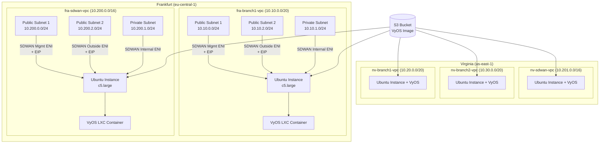
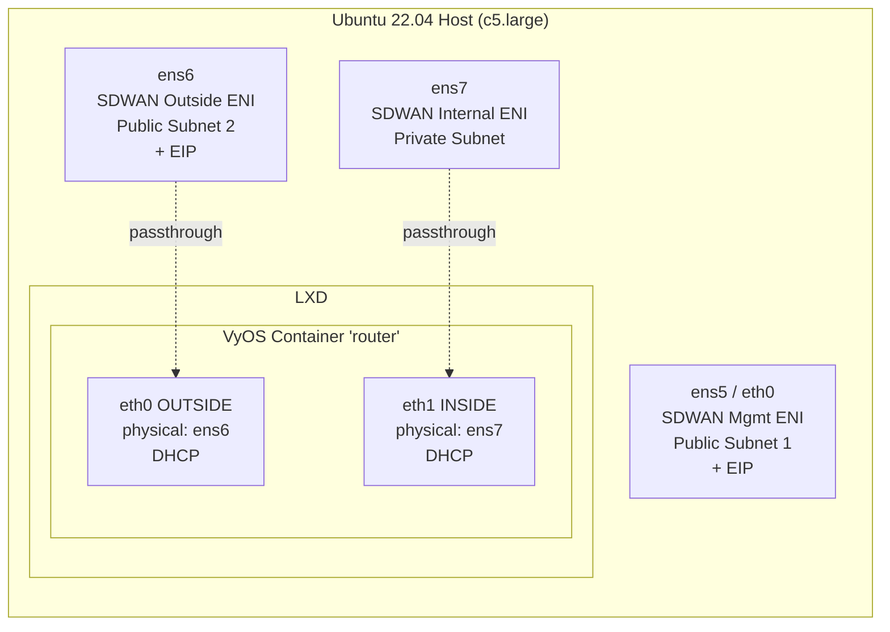

# Design Document: SD-WAN Ubuntu Instances

## Overview

This design describes the Terraform infrastructure to deploy Ubuntu 22.04 LTS EC2 instances across all 5 VPCs in the existing multi-region SD-WAN workshop environment. Each instance serves as an SD-WAN appliance host running an LXD container with a VyOS router. The design covers subnet additions, multi-ENI networking, security groups, IAM, and cloud-init bootstrapping.

The approach uses a data-driven pattern: locals define per-VPC configuration, and resources iterate over those locals. This keeps the code DRY while accommodating per-VPC differences (CIDR ranges, regions, VPC module references).

## Architecture



### Instance Internal Architecture



## Components and Interfaces

### 1. Subnet Additions (locals.tf + VPC modules)

Each VPC needs a second public subnet. The CIDR for the second public subnet is derived by offsetting from the existing public subnet:

| VPC | Existing Public | New Public Subnet 2 | Private |
|-----|----------------|---------------------|---------|
| fra-branch1-vpc | 10.10.0.0/24 | 10.10.2.0/24 | 10.10.1.0/24 |
| fra-sdwan-vpc | 10.200.0.0/24 | 10.200.2.0/24 | 10.200.1.0/24 |
| nv-branch1-vpc | 10.20.0.0/24 | 10.20.2.0/24 | 10.20.1.0/24 |
| nv-branch2-vpc | 10.30.0.0/24 | 10.30.2.0/24 | 10.30.1.0/24 |
| nv-sdwan-vpc | 10.201.0.0/24 | 10.201.2.0/24 | 10.201.1.0/24 |

The second public subnet uses the `.2.0/24` offset to avoid collision with the `.0.0/24` (public) and `.1.0/24` (private) subnets. This is added to the locals and the VPC module `public_subnets` list.

### 2. AMI Data Source

A `data "aws_ami"` block per region fetches the latest Ubuntu 22.04 LTS AMI from Canonical's official owner (099720109477). Filters:
- `name`: `ubuntu/images/hvm-ssd/ubuntu-jammy-22.04-amd64-server-*`
- `virtualization-type`: `hvm`
- `most_recent`: `true`

### 3. EC2 Instances

Each instance is defined per-region file (instances-frankfurt.tf, instances-virginia.tf). The primary ENI (SDWAN Mgmt) is created implicitly via the instance's `subnet_id` and `vpc_security_group_ids`. The other two ENIs are explicit `aws_network_interface` resources attached via `aws_network_interface_attachment`.

Instance configuration:
- `instance_type`: c5.large
- `ami`: from data source
- `subnet_id`: first public subnet (SDWAN Mgmt)
- `source_dest_check`: false
- `iam_instance_profile`: shared profile
- `user_data`: rendered cloud-init script
- `associate_public_ip_address`: false (EIP used instead)

### 4. ENI Resources

Per instance, 2 additional ENIs are created:

```hcl
resource "aws_network_interface" "sdwan_outside" {
  subnet_id         = <second_public_subnet_id>
  security_groups   = [<public_sg_id>]
  source_dest_check = false
  tags = { Name = "{vpc-name}-sdwan-outside" }
}

resource "aws_network_interface" "sdwan_internal" {
  subnet_id         = <private_subnet_id>
  security_groups   = [<private_sg_id>]
  source_dest_check = false
  tags = { Name = "{vpc-name}-sdwan-internal" }
}
```

Attachments use `device_index = 1` for outside and `device_index = 2` for internal.

### 5. Elastic IPs

Two EIPs per instance:
- One for the primary ENI (SDWAN Mgmt) — associated via `aws_eip` with `instance` attribute pointing to the EC2 instance (associates to primary ENI).
- One for the SDWAN Outside ENI — associated via `aws_eip` with `network_interface` attribute.

### 6. Security Groups

Two security groups per VPC:

**Public Security Group** (applied to SDWAN Mgmt + SDWAN Outside ENIs):
- Ingress: UDP 500 from 0.0.0.0/0 (IKE)
- Ingress: UDP 4500 from 0.0.0.0/0 (NAT-T)
- Ingress: TCP 443 from VPC CIDR (SSM)
- Egress: All traffic

**Private Security Group** (applied to SDWAN Internal ENI):
- Ingress: All from VPC CIDR
- Ingress: All from 10.0.0.0/8 (cross-VPC)
- Egress: All traffic

### 7. IAM Instance Profile

A single IAM role shared across all instances:

```
aws_iam_role "sdwan_instance_role"
  ├── Trust: ec2.amazonaws.com
  ├── Attached: AmazonSSMManagedInstanceCore
  └── Inline: s3:GetObject on arn:aws:s3:::{bucket_name}/*

aws_iam_instance_profile "sdwan_instance_profile"
  └── role: sdwan_instance_role
```

### 8. User Data Template

The user data script is a `templatefile()` that accepts:
- `vyos_s3_bucket`: bucket name
- `vyos_s3_region`: region for the S3 command

The script executes sequentially:
1. System packages (apt + snap)
2. LXD init with preseed
3. VyOS image download from S3 + import
4. Router container creation with NIC passthrough profile
5. VyOS config push + container start

### 9. File Organization

| File | Contents |
|------|----------|
| `locals.tf` | Add `public_subnet_2` CIDR to each VPC config |
| `variables.tf` | Add `vyos_s3_bucket`, `vyos_s3_region`, `sdwan_instance_type` variables |
| `vpc-frankfurt.tf` | Update VPC modules with second public subnet |
| `vpc-virginia.tf` | Update VPC modules with second public subnet |
| `instances-common.tf` | IAM role/profile, AMI data sources |
| `instances-frankfurt.tf` | Frankfurt instances, ENIs, EIPs, security groups |
| `instances-virginia.tf` | Virginia instances, ENIs, EIPs, security groups |
| `templates/user_data.sh` | Cloud-init bash script template |

## Data Models

### Locals Structure (Extended)

```hcl
locals {
  frankfurt = {
    branch1 = {
      vpc_cidr         = "10.10.0.0/20"
      public_subnet    = "10.10.0.0/24"
      public_subnet_2  = "10.10.2.0/24"    # NEW
      private_subnet   = "10.10.1.0/24"
      az               = "eu-central-1a"
      segment          = "production"
    }
    sdwan = {
      vpc_cidr         = "10.200.0.0/16"
      public_subnet    = "10.200.0.0/24"
      public_subnet_2  = "10.200.2.0/24"   # NEW
      private_subnet   = "10.200.1.0/24"
      az               = "eu-central-1a"
      segment          = "sdwan"
    }
  }
  virginia = {
    branch1 = {
      vpc_cidr         = "10.20.0.0/20"
      public_subnet    = "10.20.0.0/24"
      public_subnet_2  = "10.20.2.0/24"    # NEW
      private_subnet   = "10.20.1.0/24"
      az               = "us-east-1a"
      segment          = "production"
    }
    branch2 = {
      vpc_cidr         = "10.30.0.0/20"
      public_subnet    = "10.30.0.0/24"
      public_subnet_2  = "10.30.2.0/24"    # NEW
      private_subnet   = "10.30.1.0/24"
      az               = "us-east-1a"
      segment          = "development"
    }
    sdwan = {
      vpc_cidr         = "10.201.0.0/16"
      public_subnet    = "10.201.0.0/24"
      public_subnet_2  = "10.201.2.0/24"   # NEW
      private_subnet   = "10.201.1.0/24"
      az               = "us-east-1a"
      segment          = "sdwan"
    }
  }
}
```

### Variables (New)

```hcl
variable "sdwan_instance_type" {
  description = "EC2 instance type for SD-WAN Ubuntu instances"
  type        = string
  default     = "c5.large"
}

variable "vyos_s3_bucket" {
  description = "S3 bucket name containing the VyOS LXD image"
  type        = string
  default     = "fra-vyos-bucket"
}

variable "vyos_s3_region" {
  description = "AWS region of the VyOS S3 bucket"
  type        = string
  default     = "us-east-1"
}
```

### User Data Template Variables

| Variable | Type | Description |
|----------|------|-------------|
| `vyos_s3_bucket` | string | S3 bucket name for VyOS image |
| `vyos_s3_region` | string | AWS region for S3 command |

### Resource Naming Convention

| Resource | Name Pattern | Example |
|----------|-------------|---------|
| Instance | `{vpc-name}-sdwan-instance` | `fra-branch1-vpc-sdwan-instance` |
| SDWAN Mgmt ENI | (primary, named via instance) | `fra-branch1-vpc-sdwan-instance` |
| SDWAN Outside ENI | `{vpc-name}-sdwan-outside` | `fra-branch1-vpc-sdwan-outside` |
| SDWAN Internal ENI | `{vpc-name}-sdwan-internal` | `fra-branch1-vpc-sdwan-internal` |
| Mgmt EIP | `{vpc-name}-sdwan-mgmt-eip` | `fra-branch1-vpc-sdwan-mgmt-eip` |
| Outside EIP | `{vpc-name}-sdwan-outside-eip` | `fra-branch1-vpc-sdwan-outside-eip` |
| Public SG | `{vpc-name}-sdwan-public-sg` | `fra-branch1-vpc-sdwan-public-sg` |
| Private SG | `{vpc-name}-sdwan-private-sg` | `fra-branch1-vpc-sdwan-private-sg` |


## Correctness Properties

*A property is a characteristic or behavior that should hold true across all valid executions of a system — essentially, a formal statement about what the system should do. Properties serve as the bridge between human-readable specifications and machine-verifiable correctness guarantees.*

Since this is a Terraform infrastructure project, correctness properties are validated through `terraform plan` output analysis and Terraform-native testing (`terraform test` with `.tftest.hcl` files) rather than traditional property-based testing libraries. Each property below can be verified by inspecting the planned resource graph.

### Property 1: Subnet Topology

*For any* VPC in the configuration, the VPC module SHALL produce exactly 2 public subnets and 1 private subnet, all in the same availability zone, with non-overlapping CIDR blocks, and each public subnet tagged with `Type = "public"`.

**Validates: Requirements 1.1, 1.2, 1.3, 1.5**

### Property 2: Instance Count and Type

*For any* VPC in the configuration, there SHALL be exactly one EC2 instance of type c5.large deployed, resulting in exactly 5 instances total across all VPCs.

**Validates: Requirements 2.1, 2.2**

### Property 3: ENI Topology

*For any* Ubuntu instance, the instance SHALL have exactly 3 ENIs: SDWAN Mgmt at device index 0 in the first public subnet, SDWAN Outside at device index 1 in the second public subnet, and SDWAN Internal at device index 2 in the private subnet. All 3 ENIs SHALL have source/destination checking disabled.

**Validates: Requirements 3.1, 3.2, 3.3, 3.4, 2.5, 3.7**

### Property 4: EIP Assignment

*For any* Ubuntu instance, the SDWAN Mgmt ENI and SDWAN Outside ENI SHALL each have exactly one Elastic IP associated, and the SDWAN Internal ENI SHALL have zero Elastic IPs associated.

**Validates: Requirements 3.5, 3.6**

### Property 5: Public Security Group Rules

*For any* VPC, the Public Security Group SHALL contain ingress rules for UDP 500, UDP 4500 from 0.0.0.0/0, TCP 443 from the VPC CIDR, and an allow-all egress rule. The Public Security Group SHALL be applied to both the SDWAN Mgmt ENI and SDWAN Outside ENI.

**Validates: Requirements 4.1, 4.2, 4.3, 4.4**

### Property 6: Private Security Group Rules

*For any* VPC, the Private Security Group SHALL contain ingress rules allowing all traffic from the VPC CIDR and from 10.0.0.0/8, and an allow-all egress rule. The Private Security Group SHALL be applied to the SDWAN Internal ENI.

**Validates: Requirements 4.5, 4.6, 4.7, 4.8**

### Property 7: IAM Profile Shared Across Instances

*For any* Ubuntu instance, the instance SHALL reference the same IAM instance profile, and that profile SHALL include the AmazonSSMManagedInstanceCore policy and S3 read access to the VyOS bucket.

**Validates: Requirements 5.4, 5.5**

### Property 8: Resource Naming Convention

*For any* resource (instance, ENI, EIP, security group) in the configuration, the Name tag SHALL follow the pattern `{vpc-name}-sdwan-{role}` where role corresponds to the resource function (instance, mgmt, outside, internal, mgmt-eip, outside-eip, public-sg, private-sg).

**Validates: Requirements 8.1, 8.2, 8.3, 8.4**

## Error Handling

### Terraform Plan Failures

- If the second public subnet CIDR overlaps with existing subnets, Terraform will fail at plan time with a CIDR conflict error. The locals structure prevents this by using a consistent `.2.0/24` offset.
- If the c5.large instance type is not available in the selected AZ, Terraform will fail at apply time. The AZ is fixed per VPC config in locals.

### AMI Lookup Failures

- If no Ubuntu 22.04 LTS AMI matches the filter, the `data.aws_ami` will fail. The filter uses Canonical's official owner ID (099720109477) which is stable.

### User Data Failures

- If the S3 bucket does not exist or the IAM role lacks permissions, the `aws s3 cp` command in user data will fail silently (cloud-init continues). The user should check `/var/log/cloud-init-output.log` on the instance.
- If LXD snap installation fails, subsequent LXD commands will fail. The script does not include error handling (`set -e` is intentionally omitted to allow partial progress).

### ENI Attachment Ordering

- ENI attachments depend on the instance being running. Terraform handles this via implicit dependencies. If an ENI attachment fails, Terraform will report the error and the instance will have fewer than 3 ENIs.

## Testing Strategy

### Terraform Validate and Plan

The primary validation mechanism is `terraform validate` (syntax) and `terraform plan` (resource graph). These catch:
- HCL syntax errors
- Invalid resource references
- CIDR conflicts
- Missing required arguments

### Terraform Test (`.tftest.hcl`)

Terraform native tests can validate the correctness properties:

- **Unit-level tests** (`terraform test` with mock providers): Validate resource counts, attribute values, and naming conventions without deploying infrastructure.
- **Property-level tests**: Each correctness property maps to one or more test assertions in a `.tftest.hcl` file.

Test configuration: Each test run validates all 8 properties. Tests use `command = plan` to avoid actual infrastructure deployment.

Tag format for property tests: **Feature: sdwan-ubuntu-instances, Property {number}: {property_text}**

### Manual Validation

After `terraform apply`:
1. Verify instances are running in all 5 VPCs via AWS Console
2. Verify VyOS container is running via SSM Session Manager: `lxc list`
3. Verify VyOS interfaces are up: `lxc exec router -- show interfaces`
4. Verify VPN connectivity between appliances
