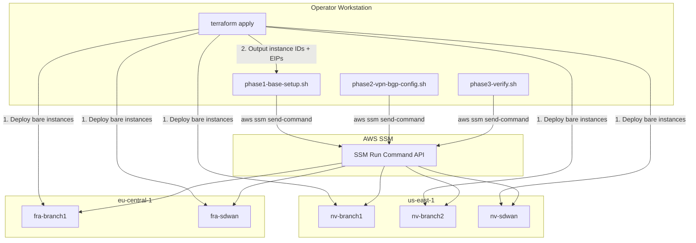
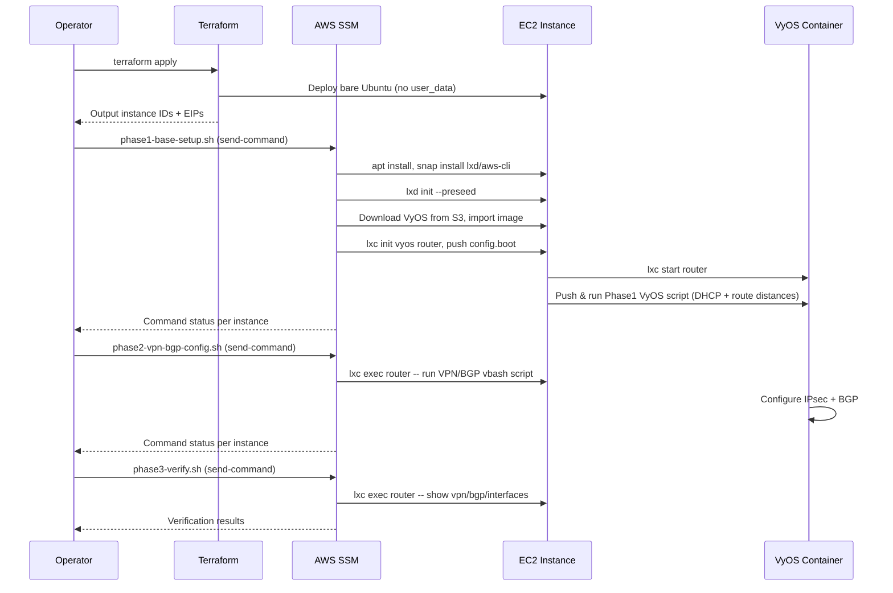

# Design Document: SSM-Based VyOS Configuration

## Overview

This design replaces the cloud-init user_data.sh bootstrap with a three-phase SSM Run Command approach. Terraform deploys bare Ubuntu 22.04 instances with no user_data. After `terraform apply` completes, the operator runs local bash scripts that use `aws ssm send-command` to configure each instance remotely. This eliminates boot-timing issues with snap/apt that made user_data unreliable.

The three phases are:
1. **Phase 1 — Base Setup**: Install packages, initialize LXD, deploy VyOS container, apply DHCP config
2. **Phase 2 — VPN/BGP Config**: Push IPsec VPN tunnels and BGP peering configuration to each VyOS router
3. **Phase 3 — Verify**: Check tunnel status, BGP sessions, interfaces, and connectivity

Each phase is an independent, rerunnable bash script targeting instances across both us-east-1 and eu-central-1 via SSM.

## Architecture



### Execution Flow



## Components and Interfaces

### Component 1: Terraform Configuration Changes

**Files modified**: `instances-virginia.tf`, `instances-frankfurt.tf`, `outputs.tf`

- Remove `user_data` block from all 5 `aws_instance` resources
- Add instance ID outputs to `outputs.tf` for all 5 instances

### Component 2: phase1-base-setup.sh

**Location**: Project root

**Interface**:
```bash
# Usage:
./phase1-base-setup.sh
# Or with explicit instance IDs:
./phase1-base-setup.sh --nv-branch1 i-xxx --nv-branch2 i-xxx --nv-sdwan i-xxx --fra-branch1 i-xxx --fra-sdwan i-xxx
```

**Configurable variables** (top of script):
```bash
VYOS_S3_BUCKET="fra-vyos-bucket"
VYOS_S3_REGION="us-east-1"
VYOS_S3_KEY="vyos_dxgl-1.3.3-bc64a3a-5_lxd_amd64.tar.gz"
UBUNTU_PASSWORD="aws123"
SSM_TIMEOUT=600
```

**Internal structure**:
1. `get_instance_ids()` — reads from terraform output or CLI args
2. `wait_for_ssm()` — polls SSM until instance is registered
3. `send_and_wait()` — sends SSM command and waits for completion, returns exit status
4. `build_phase1_commands()` — constructs the shell commands string for SSM
5. Main loop — iterates over instances, groups by region, sends commands

**SSM command payload** (executed on each instance):
```bash
#!/bin/bash
set -e
apt-get update -y
apt-get install -y python3-pip net-tools tmux curl unzip jq
snap wait system seed.loaded
snap refresh --hold=forever
snap install lxd
snap install aws-cli --classic
echo "ubuntu:${UBUNTU_PASSWORD}" | chpasswd

# LXD init
cat > /tmp/lxd.yaml <<'EOF'
config:
  images.auto_update_cached: false
storage_pools:
- name: default
  driver: dir
profiles:
- devices:
    root:
      path: /
      pool: default
      type: disk
  name: default
EOF
cat /tmp/lxd.yaml | lxd init --preseed

# Download and import VyOS
aws --region ${VYOS_S3_REGION} s3 cp s3://${VYOS_S3_BUCKET}/${VYOS_S3_KEY} /tmp/vyos.tar.gz
lxc image import /tmp/vyos.tar.gz --alias vyos

# Router container config
cat > /tmp/router.yaml <<'EOF'
architecture: x86_64
config:
  limits.cpu: '1'
  limits.memory: 2048MiB
devices:
  eth0:
    nictype: physical
    parent: ens6
    type: nic
  eth1:
    nictype: physical
    parent: ens7
    type: nic
EOF

# Idempotency: remove existing container if present
lxc stop router --force 2>/dev/null || true
lxc delete router 2>/dev/null || true

cat /tmp/router.yaml | lxc init vyos router

# Base config.boot
cat > /tmp/config.boot <<'BOOTEOF'
interfaces {
    ethernet eth0 {
        address dhcp
        description OUTSIDE
    }
    ethernet eth1 {
        address dhcp
        description INSIDE
    }
    loopback lo {
    }
}
system {
    config-management {
        commit-revisions 100
    }
    host-name vyos
    login {
        user vyos {
            authentication {
                plaintext-password "aws123"
            }
        }
    }
    syslog {
        global {
            facility all {
                level info
            }
        }
    }
}
BOOTEOF

lxc file push /tmp/config.boot router/opt/vyatta/etc/config/config.boot
lxc start router
sleep 30

# Phase 1 VyOS script
cat > /tmp/vyos-phase1.sh <<'VYOSEOF'
#!/bin/vbash
source /opt/vyatta/etc/functions/script-template
configure
set interfaces ethernet eth0 description 'OUTSIDE'
set interfaces ethernet eth0 address dhcp
set interfaces ethernet eth0 dhcp-options default-route-distance 10
set interfaces ethernet eth1 description 'INSIDE'
set interfaces ethernet eth1 address dhcp
set interfaces ethernet eth1 dhcp-options default-route-distance 210
commit
save
exit
VYOSEOF

lxc file push /tmp/vyos-phase1.sh router/tmp/vyos-phase1.sh
lxc exec router -- chmod +x /tmp/vyos-phase1.sh
lxc exec router -- /tmp/vyos-phase1.sh
```

### Component 3: phase2-vpn-bgp-config.sh

**Location**: Project root

**Interface**:
```bash
# Usage (reads from terraform output):
./phase2-vpn-bgp-config.sh
```

**Configurable variables** (top of script):
```bash
VPN_PSK="aws123"
SDWAN_BGP_ASN=65001
BRANCH_BGP_ASN=65002
SSM_TIMEOUT=300
```

**Internal structure**:
1. `get_terraform_outputs()` — reads instance IDs and EIPs from terraform output
2. `build_vpn_bgp_script()` — generates per-router vbash config script with correct EIPs, ASNs, VTI addresses
3. `push_config()` — sends SSM command to push and execute vbash script via `lxc exec router`
4. Main loop — iterates over all 5 instances with their specific VPN/BGP parameters

**VPN/BGP topology** (VTI addressing):

| Tunnel | Router A | VTI A | Router B | VTI B | Subnet |
|--------|----------|-------|----------|-------|--------|
| nv-sdwan ↔ nv-branch1 | nv-sdwan | 169.254.100.1/30 | nv-branch1 | 169.254.100.2/30 | 169.254.100.0/30 |
| nv-sdwan ↔ nv-branch2 | nv-sdwan | 169.254.100.5/30 | nv-branch2 | 169.254.100.6/30 | 169.254.100.4/30 |
| nv-sdwan ↔ fra-sdwan | nv-sdwan | 169.254.100.9/30 | fra-sdwan | 169.254.100.10/30 | 169.254.100.8/30 |
| fra-sdwan ↔ fra-branch1 | fra-sdwan | 169.254.100.13/30 | fra-branch1 | 169.254.100.14/30 | 169.254.100.12/30 |

**Loopback addresses**:

| Router | Loopback | BGP ASN |
|--------|----------|---------|
| nv-sdwan | 10.255.0.1/32 | 65001 |
| nv-branch1 | 10.255.1.1/32 | 65002 |
| nv-branch2 | 10.255.2.1/32 | 65002 |
| fra-sdwan | 10.255.10.1/32 | 65001 |
| fra-branch1 | 10.255.11.1/32 | 65002 |

**Per-router vbash script pattern** (example for nv-branch1):
```bash
#!/bin/vbash
source /opt/vyatta/etc/functions/script-template
configure

# Loopback
set interfaces loopback lo address 10.255.1.1/32

# VTI to nv-sdwan
set interfaces vti vti0 address 169.254.100.2/30

# IPsec
set vpn ipsec interface eth0
set vpn ipsec esp-group ESP-GROUP compression disable
set vpn ipsec esp-group ESP-GROUP lifetime 3600
set vpn ipsec esp-group ESP-GROUP mode tunnel
set vpn ipsec esp-group ESP-GROUP pfs dh-group14
set vpn ipsec esp-group ESP-GROUP proposal 1 encryption aes256gcm128
set vpn ipsec esp-group ESP-GROUP proposal 1 hash sha256
set vpn ipsec ike-group IKE-GROUP key-exchange ikev2
set vpn ipsec ike-group IKE-GROUP lifetime 28800
set vpn ipsec ike-group IKE-GROUP proposal 1 dh-group 14
set vpn ipsec ike-group IKE-GROUP proposal 1 encryption aes256gcm128
set vpn ipsec ike-group IKE-GROUP proposal 1 hash sha256
set vpn ipsec site-to-site peer ${NV_SDWAN_EIP} authentication mode pre-shared-secret
set vpn ipsec site-to-site peer ${NV_SDWAN_EIP} authentication pre-shared-secret '${VPN_PSK}'
set vpn ipsec site-to-site peer ${NV_SDWAN_EIP} connection-type initiate
set vpn ipsec site-to-site peer ${NV_SDWAN_EIP} ike-group IKE-GROUP
set vpn ipsec site-to-site peer ${NV_SDWAN_EIP} local-address ${NV_BRANCH1_EIP}
set vpn ipsec site-to-site peer ${NV_SDWAN_EIP} vti bind vti0
set vpn ipsec site-to-site peer ${NV_SDWAN_EIP} vti esp-group ESP-GROUP

# BGP
set protocols bgp 65002 neighbor 169.254.100.1 ebgp-multihop 2
set protocols bgp 65002 neighbor 169.254.100.1 remote-as 65001
set protocols bgp 65002 neighbor 169.254.100.1 update-source 169.254.100.2
set protocols bgp 65002 network 10.255.1.1/32
set protocols bgp 65002 parameters router-id 10.255.1.1

commit
save
exit
```

### Component 4: phase3-verify.sh

**Location**: Project root

**Interface**:
```bash
./phase3-verify.sh
```

**Internal structure**:
1. `get_instance_ids()` — reads from terraform output or CLI args
2. `run_vyos_command()` — sends SSM command to run a VyOS show command via `lxc exec router`
3. `verify_instance()` — runs all verification checks on a single instance
4. Main loop — iterates over all 5 instances, collects and formats output

**Verification commands per instance**:
```bash
lxc exec router -- /opt/vyatta/bin/vyatta-op-cmd-wrapper show vpn ipsec sa
lxc exec router -- /opt/vyatta/bin/vyatta-op-cmd-wrapper show ip bgp summary
lxc exec router -- /opt/vyatta/bin/vyatta-op-cmd-wrapper show interfaces
# Ping tests across VTI tunnels (peer VTI addresses)
lxc exec router -- ping -c 3 -W 2 <peer_vti_address>
```

## Data Models

### Terraform Output Structure

New outputs added to `outputs.tf`:
```hcl
output "nv_branch1_instance_id" {
  value = aws_instance.nv_branch1_sdwan_instance.id
}
output "nv_branch2_instance_id" {
  value = aws_instance.nv_branch2_sdwan_instance.id
}
output "nv_sdwan_instance_id" {
  value = aws_instance.nv_sdwan_sdwan_instance.id
}
output "fra_branch1_instance_id" {
  value = aws_instance.fra_branch1_sdwan_instance.id
}
output "fra_sdwan_instance_id" {
  value = aws_instance.fra_sdwan_sdwan_instance.id
}
```

### Instance Configuration Map

Each script uses an internal data structure mapping instance names to their properties:

```bash
# Instance name -> region, instance_id, outside_eip, loopback, bgp_asn, role
declare -A INSTANCES=(
  ["nv-branch1"]="us-east-1|<id>|<eip>|10.255.1.1|65002|branch"
  ["nv-branch2"]="us-east-1|<id>|<eip>|10.255.2.1|65002|branch"
  ["nv-sdwan"]="us-east-1|<id>|<eip>|10.255.0.1|65001|sdwan"
  ["fra-branch1"]="eu-central-1|<id>|<eip>|10.255.11.1|65002|branch"
  ["fra-sdwan"]="eu-central-1|<id>|<eip>|10.255.10.1|65001|sdwan"
)
```

### VPN Tunnel Topology Map

```bash
# Each tunnel: router_a|router_b|vti_a_addr|vti_b_addr|vti_a_name|vti_b_name
TUNNELS=(
  "nv-sdwan|nv-branch1|169.254.100.1/30|169.254.100.2/30|vti0|vti0"
  "nv-sdwan|nv-branch2|169.254.100.5/30|169.254.100.6/30|vti1|vti0"
  "nv-sdwan|fra-sdwan|169.254.100.9/30|169.254.100.10/30|vti2|vti0"
  "fra-sdwan|fra-branch1|169.254.100.13/30|169.254.100.14/30|vti1|vti0"
)
```


## Correctness Properties

*A property is a characteristic or behavior that should hold true across all valid executions of a system — essentially, a formal statement about what the system should do. Properties serve as the bridge between human-readable specifications and machine-verifiable correctness guarantees.*

Since this feature is primarily infrastructure bash scripts and Terraform configuration changes, the testable properties focus on the correctness of generated command payloads, configuration data structures, and topology mappings. Many acceptance criteria are integration-level (requiring AWS API access) and are verified by Phase 3 instead.

### Property 1: Phase1 command payload contains all required packages

*For any* instance targeted by Phase1, the generated SSM command payload SHALL contain install commands for all required packages: python3-pip, net-tools, tmux, curl, unzip, jq, lxd (snap), and aws-cli (snap).

**Validates: Requirements 3.5**

### Property 2: Phase1 snap ordering is correct

*For any* instance targeted by Phase1, the generated SSM command payload SHALL contain "snap wait system seed.loaded" at a position before any "snap install" command.

**Validates: Requirements 3.6**

### Property 3: Phase2 IPsec config uses correct tunnel endpoints

*For any* tunnel in the VPN topology, the generated IPsec configuration for router A SHALL reference router B's Outside_EIP as the remote peer, and vice versa. Both sides SHALL use the configured PSK ("aws123").

**Validates: Requirements 4.4**

### Property 4: VTI addresses form valid /30 pairs

*For any* tunnel in the VPN topology, the two VTI addresses assigned to the tunnel endpoints SHALL be consecutive addresses within the same /30 subnet (e.g., .1/.2, .5/.6, .9/.10, .13/.14).

**Validates: Requirements 4.5**

### Property 5: BGP ASN matches router role

*For any* router in the topology, the BGP ASN in the generated configuration SHALL be 65001 if the router's role is "sdwan" and 65002 if the router's role is "branch".

**Validates: Requirements 4.6**

### Property 6: All loopback addresses are unique

*For all* 5 routers, the assigned loopback /32 addresses SHALL be pairwise distinct.

**Validates: Requirements 4.7**

### Property 7: Instance-to-region mapping is consistent

*For any* instance, all SSM send-command and get-command-invocation calls SHALL use "us-east-1" for instances named nv-branch1, nv-branch2, nv-sdwan, and "eu-central-1" for instances named fra-branch1, fra-sdwan.

**Validates: Requirements 7.1, 7.2, 7.3, 7.4, 7.5**

### Property 8: Verification ping targets match VTI peer addresses

*For any* tunnel in the VPN topology, the Phase3 verification script SHALL ping the remote VTI address from the local router (e.g., nv-branch1 pings 169.254.100.1, nv-sdwan pings 169.254.100.2 for that tunnel).

**Validates: Requirements 5.6**

## Error Handling

### Phase1 Error Handling

| Error Condition | Handling Strategy |
|----------------|-------------------|
| Instance not registered with SSM | Poll `aws ssm describe-instance-information` with retries before sending commands. Report and skip if not registered after timeout. |
| LXD already initialized | `lxd init --preseed` is idempotent when using the same preseed config. No special handling needed. |
| Existing "router" container | `lxc stop router --force 2>/dev/null || true` and `lxc delete router 2>/dev/null || true` before `lxc init`. |
| S3 download failure | SSM command exits with non-zero. Script detects via `get-command-invocation` status and reports failure. |
| SSM command timeout | Script polls with configurable timeout (default 600s). Reports timeout and continues to next instance. |
| apt/snap transient failure | `set -e` in SSM payload causes immediate failure. Operator reruns Phase1 on failed instance. |

### Phase2 Error Handling

| Error Condition | Handling Strategy |
|----------------|-------------------|
| Router container not running | Check `lxc list --format csv` for "router,RUNNING" before pushing config. Report and skip if not running. |
| VyOS commit failure | vbash script exits non-zero on commit failure. SSM reports failure. Operator investigates and reruns. |
| Incorrect EIP (instance replaced) | Script reads fresh EIPs from `terraform output` each run. |

### Phase3 Error Handling

| Error Condition | Handling Strategy |
|----------------|-------------------|
| Tunnel not established | `show vpn ipsec sa` returns empty or "down" status. Script reports per-tunnel status. |
| BGP session not established | `show ip bgp summary` shows "Idle" or "Active" state. Script reports per-neighbor status. |
| Ping failure | `ping -c 3 -W 2` returns non-zero. Script reports unreachable peer. |

## Testing Strategy

### Approach

This feature consists of Terraform HCL changes and bash scripts. Traditional unit testing and property-based testing apply to the data structures and configuration generation logic. Integration testing requires actual AWS infrastructure.

### Static Validation (Unit Tests)

- **Terraform validation**: `terraform validate` and `terraform plan` to verify HCL syntax and no user_data references
- **Shell script linting**: `shellcheck` on all 3 bash scripts for syntax and common errors
- **Script content checks**: Verify scripts contain required commands, correct variable definitions, and proper error handling patterns

### Property-Based Testing

Since the scripts are flat bash, property-based testing applies to the configuration data structures (tunnel topology, instance-region mapping, VTI addressing). These can be tested by extracting the data structures into a testable format or by parsing the generated scripts.

**Library**: For bash script validation, use a test harness (e.g., `bats-core`) with parameterized tests over the topology data. Alternatively, extract the topology data into a JSON file and test with a Python script using `hypothesis`.

**Configuration**:
- Minimum 100 iterations per property test
- Each test tagged with: **Feature: ssm-vyos-config, Property {N}: {title}**

### Integration Testing (Phase 3)

Phase 3 (phase3-verify.sh) serves as the integration test suite. It validates:
- IPsec tunnel establishment across all 4 tunnels
- BGP session establishment and route exchange
- Interface status on all 5 routers
- End-to-end connectivity via VTI ping tests

This is run manually after Phase 1 and Phase 2 complete successfully.

### Test Execution Order

1. `shellcheck phase1-base-setup.sh phase2-vpn-bgp-config.sh phase3-verify.sh`
2. `terraform validate` and `terraform plan` (verify no user_data, outputs present)
3. `terraform apply` (deploy bare instances)
4. `./phase1-base-setup.sh` (base setup)
5. `./phase2-vpn-bgp-config.sh` (VPN/BGP config)
6. `./phase3-verify.sh` (integration verification)
