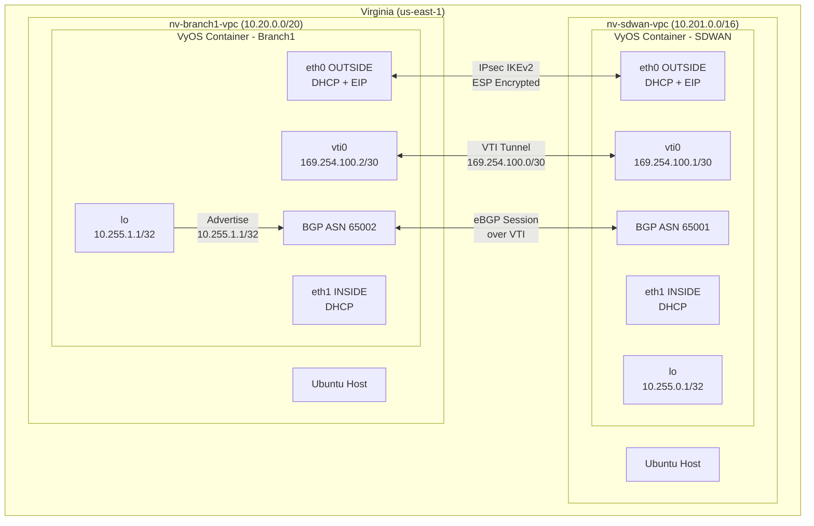
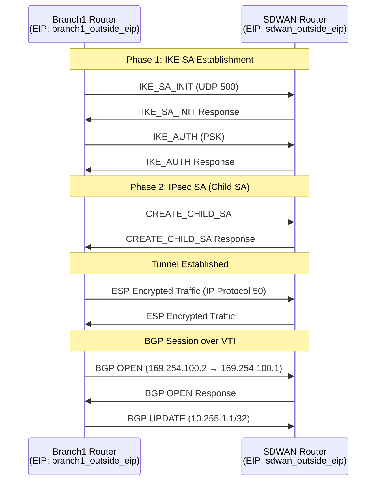

# Design Document: VyOS VPN and BGP Configuration

## Overview

This design extends the existing SD-WAN infrastructure to establish IPsec VPN connectivity and BGP routing between the nv_branch1 and nv_sdwan VyOS routers in the us-east-1 region. The implementation uses Terraform templatefile() to render VyOS configuration templates with Elastic IP addresses known at plan time, enabling fully automated VPN and BGP establishment on instance boot.

The approach modifies the existing user_data.sh template to accept a rendered VyOS configuration block, which replaces the default DHCP-only config.boot. This ensures the VPN tunnel and BGP session come up automatically without manual intervention after the LXD container starts.

## Architecture



### VPN Tunnel Architecture



## Components and Interfaces

### 1. VyOS Configuration Templates

Two new template files are created in the `templates/` directory:

| File | Purpose | Key Variables |
|------|---------|---------------|
| `vyos_config_nv_sdwan.tpl` | SDWAN hub router config | `local_eip`, `remote_eip`, `psk`, `local_asn`, `remote_asn` |
| `vyos_config_nv_branch1.tpl` | Branch1 spoke router config | `local_eip`, `remote_eip`, `psk`, `local_asn`, `remote_asn` |

Each template produces a complete VyOS config.boot file with:
- Ethernet interfaces (eth0, eth1) with DHCP
- VTI interface for IPsec tunnel termination
- Loopback interface for router-id
- IPsec VPN configuration (IKE + ESP)
- BGP configuration with neighbor and network statements

### 2. User Data Script Modifications

The existing `user_data.sh` template is extended to accept a `vyos_config` variable containing the rendered VyOS configuration. The script modification:

```bash
# Instead of using config.boot.default, use the rendered config
cat > /tmp/vyos-config/config.boot << 'VYOS_CONFIG'
${vyos_config}
VYOS_CONFIG
```

This replaces the hardcoded default configuration with the fully rendered VPN/BGP configuration.

### 3. IPsec VPN Configuration Structure

The VyOS IPsec configuration follows this hierarchy:

```
vpn {
    ipsec {
        interface eth0
        
        esp-group ESP-GROUP {
            compression disable
            lifetime 3600
            mode tunnel
            pfs dh-group14
            proposal 1 {
                encryption aes256
                hash sha256
            }
        }
        
        ike-group IKE-GROUP {
            key-exchange ikev2
            lifetime 28800
            proposal 1 {
                dh-group 14
                encryption aes256
                hash sha256
            }
        }
        
        site-to-site {
            peer <remote_eip> {
                authentication {
                    mode pre-shared-secret
                    pre-shared-secret <psk>
                }
                connection-type initiate
                ike-group IKE-GROUP
                local-address <local_eip>
                vti {
                    bind vti0
                    esp-group ESP-GROUP
                }
            }
        }
    }
}
```

### 4. BGP Configuration Structure

```
protocols {
    bgp <local_asn> {
        neighbor <remote_vti_ip> {
            remote-as <remote_asn>
            update-source <local_vti_ip>
        }
        network <loopback_network>
        parameters {
            router-id <loopback_ip>
        }
    }
}
```

### 5. Security Group Updates

The existing public security groups for nv_branch1 and nv_sdwan VPCs need an additional ingress rule:

```hcl
ingress {
  description = "ESP"
  from_port   = 0
  to_port     = 0
  protocol    = "50"  # ESP protocol number
  cidr_blocks = ["0.0.0.0/0"]
}
```

### 6. Terraform Variable Additions

New variables in `variables.tf`:

```hcl
variable "vpn_psk" {
  description = "Pre-shared key for IPsec VPN authentication"
  type        = string
  sensitive   = true
  default     = null  # Generated if not provided
}

variable "sdwan_bgp_asn" {
  description = "BGP ASN for SDWAN router"
  type        = number
  default     = 65001
}

variable "branch1_bgp_asn" {
  description = "BGP ASN for Branch1 router"
  type        = number
  default     = 65002
}

variable "vpn_tunnel_cidr" {
  description = "CIDR for VPN tunnel interfaces"
  type        = string
  default     = "169.254.100.0/30"
}
```

### 7. Random PSK Generation

If `vpn_psk` is not provided, generate one:

```hcl
resource "random_password" "vpn_psk" {
  count   = var.vpn_psk == null ? 1 : 0
  length  = 32
  special = false
}

locals {
  vpn_psk = var.vpn_psk != null ? var.vpn_psk : random_password.vpn_psk[0].result
}
```

## Data Models

### Template Variables

| Variable | Type | Source | Description |
|----------|------|--------|-------------|
| `local_eip` | string | `aws_eip.*.public_ip` | Local router's Outside EIP |
| `remote_eip` | string | `aws_eip.*.public_ip` | Remote router's Outside EIP |
| `psk` | string | `local.vpn_psk` | IPsec pre-shared key |
| `local_asn` | number | `var.*_bgp_asn` | Local BGP ASN |
| `remote_asn` | number | `var.*_bgp_asn` | Remote BGP ASN |
| `local_vti_ip` | string | Derived from `var.vpn_tunnel_cidr` | Local VTI interface IP |
| `remote_vti_ip` | string | Derived from `var.vpn_tunnel_cidr` | Remote VTI interface IP |
| `loopback_ip` | string | Hardcoded per router | Loopback interface IP |

### IP Address Assignments

| Router | VTI IP | Loopback IP | BGP ASN |
|--------|--------|-------------|---------|
| nv_sdwan | 169.254.100.1/30 | 10.255.0.1/32 | 65001 |
| nv_branch1 | 169.254.100.2/30 | 10.255.1.1/32 | 65002 |

### VyOS Configuration Template Structure

```
interfaces {
    ethernet eth0 { address dhcp; description "OUTSIDE" }
    ethernet eth1 { address dhcp; description "INSIDE" }
    loopback lo { address <loopback_ip>/32 }
    vti vti0 { address <local_vti_ip>/30 }
}
system {
    host-name <hostname>
    login { user vyos { authentication { plaintext-password "" } } }
}
vpn {
    ipsec { ... }
}
protocols {
    bgp <local_asn> { ... }
}
```

### File Organization

| File | Changes |
|------|---------|
| `templates/user_data.sh` | Add `vyos_config` variable, modify config.boot creation |
| `templates/vyos_config_nv_sdwan.tpl` | New file - SDWAN router VyOS config |
| `templates/vyos_config_nv_branch1.tpl` | New file - Branch1 router VyOS config |
| `variables.tf` | Add VPN/BGP variables |
| `instances-virginia.tf` | Update templatefile() calls, add ESP security group rule |


## Correctness Properties

*A property is a characteristic or behavior that should hold true across all valid executions of a system — essentially, a formal statement about what the system should do. Properties serve as the bridge between human-readable specifications and machine-verifiable correctness guarantees.*

Since this is a Terraform infrastructure project, correctness properties are validated through `terraform plan` output analysis, `terraform validate`, and manual inspection of rendered templates. Each property below can be verified by examining the planned resource graph or template output.

### Property 1: Template EIP Injection

*For any* VyOS configuration template rendering, the rendered output SHALL contain valid IPv4 addresses (from Elastic IPs) in the local-address and peer address fields, not template variable placeholders.

**Validates: Requirements 1.2, 2.6**

### Property 2: VyOS Configuration Syntax Validity

*For any* rendered VyOS configuration template, the output SHALL contain all required configuration blocks (interfaces, vpn, protocols) in valid VyOS config.boot syntax with proper brace matching and indentation.

**Validates: Requirements 1.3**

### Property 3: IKEv2 Protocol Configuration

*For any* VyOS configuration template, the IPsec ike-group configuration SHALL specify "key-exchange ikev2" to enforce IKEv2 protocol usage.

**Validates: Requirements 2.1**

### Property 4: PSK Authentication Mode

*For any* VyOS configuration template, the IPsec peer authentication configuration SHALL specify "mode pre-shared-secret" and include a non-empty pre-shared-secret value.

**Validates: Requirements 2.2**

### Property 5: IPsec Encryption Standards

*For any* VyOS configuration template, the ESP and IKE proposals SHALL specify "encryption aes256" and "hash sha256" for cryptographic strength.

**Validates: Requirements 2.3**

### Property 6: VTI Interface Presence

*For any* VyOS configuration template, the interfaces block SHALL contain a "vti vti0" interface definition with an address from the 169.254.100.0/30 subnet.

**Validates: Requirements 2.4**

### Property 7: VTI IP Assignment Correctness

*For any* pair of VyOS configuration templates (sdwan and branch1), the VTI addresses SHALL be complementary within the /30 subnet: sdwan uses .1 and branch1 uses .2.

**Validates: Requirements 2.5**

### Property 8: BGP ASN Assignment

*For any* VyOS configuration template, the BGP configuration SHALL use the correct private ASN: 65001 for sdwan router, 65002 for branch1 router.

**Validates: Requirements 3.1**

### Property 9: BGP Neighbor Configuration

*For any* VyOS configuration template, the BGP neighbor address SHALL be the remote router's VTI IP (sdwan neighbors 169.254.100.2, branch1 neighbors 169.254.100.1).

**Validates: Requirements 3.2**

### Property 10: BGP Multihop Configuration

*For any* VyOS configuration template with eBGP peering, the neighbor configuration SHALL include ebgp-multihop with TTL >= 2.

**Validates: Requirements 3.3**

### Property 11: BGP Network Advertisement

*For any* VyOS configuration template for branch1, the BGP configuration SHALL include a network statement for 10.255.1.1/32 (loopback network).

**Validates: Requirements 3.4**

### Property 12: BGP Router-ID Configuration

*For any* VyOS configuration template, the BGP parameters SHALL include a router-id set to the router's loopback IP address.

**Validates: Requirements 3.7**

### Property 13: Loopback Interface Configuration

*For any* VyOS configuration template, the interfaces block SHALL contain a loopback "lo" interface with the correct IP: 10.255.0.1/32 for sdwan, 10.255.1.1/32 for branch1.

**Validates: Requirements 4.1, 4.4**

### Property 14: PSK Generation Fallback

*For any* Terraform configuration where var.vpn_psk is null, the random_password resource SHALL be created with length 32 and the local.vpn_psk SHALL reference this generated value.

**Validates: Requirements 5.5**

### Property 15: ESP Security Group Rule

*For any* public security group in nv_branch1 or nv_sdwan VPCs, the ingress rules SHALL include protocol 50 (ESP) from 0.0.0.0/0.

**Validates: Requirements 6.1**

### Property 16: Existing Security Rules Preserved

*For any* public security group in nv_branch1 or nv_sdwan VPCs, the ingress rules SHALL continue to include UDP 500 (IKE) and UDP 4500 (NAT-T) from 0.0.0.0/0.

**Validates: Requirements 6.2**

### Property 17: Interface Configuration Completeness

*For any* VyOS configuration template, the interfaces block SHALL contain all four interface types: ethernet eth0 (DHCP), ethernet eth1 (DHCP), loopback lo, and vti vti0.

**Validates: Requirements 7.1, 7.2, 7.3**

## Error Handling

### Template Rendering Errors

- If an Elastic IP resource is not yet created when the template is rendered, Terraform will fail with an unknown value error. The EIP resources must be defined before the instance resources that reference them.
- If template variable names don't match the templatefile() call, Terraform will fail at plan time with a clear error message.

### VyOS Configuration Errors

- If the VyOS config.boot syntax is invalid, the VyOS container will fail to load the configuration and fall back to a minimal default. Check `/var/log/vyatta/vyatta-config-loader.log` inside the container.
- If the PSK doesn't match between peers, the IKE negotiation will fail. Both routers must use the same PSK value from the shared Terraform variable.

### VPN Establishment Failures

- If security groups don't allow ESP (protocol 50), the IPsec tunnel will fail to pass encrypted traffic even if IKE succeeds. Verify ESP rule is present.
- If the remote EIP is incorrect, IKE will fail to connect. Verify the template variables are correctly mapped.

### BGP Session Failures

- If the VPN tunnel is not established, BGP will fail to connect since it peers over VTI addresses. Verify IPsec is up first.
- If ASNs are misconfigured (same ASN on both sides), BGP will treat it as iBGP instead of eBGP. Verify ASNs are different.

### Terraform State Issues

- If the random_password resource is destroyed and recreated, the PSK will change and break the VPN. Use `lifecycle { prevent_destroy = true }` or store the PSK externally.

## Testing Strategy

### Terraform Validation

The primary validation mechanism is `terraform validate` (syntax) and `terraform plan` (resource graph). These catch:
- HCL syntax errors
- Invalid resource references
- Missing required arguments
- Template rendering errors

### Template Output Inspection

For VyOS configuration templates, validate by:
1. Running `terraform plan` and examining the rendered user_data
2. Extracting the VyOS config section and validating syntax
3. Checking that all required configuration blocks are present

### Manual Verification Checklist

After `terraform apply`:

1. **VPN Tunnel Status**: SSH to VyOS container and run:
   ```
   show vpn ipsec sa
   show vpn ipsec status
   ```
   Expected: Tunnel shows "up" state with traffic counters.

2. **BGP Session Status**: Run:
   ```
   show ip bgp summary
   show ip bgp neighbors
   ```
   Expected: Neighbor shows "Established" state.

3. **Route Advertisement**: Run on sdwan router:
   ```
   show ip bgp
   show ip route bgp
   ```
   Expected: 10.255.1.1/32 route received from branch1.

4. **Connectivity Test**: Ping across the tunnel:
   ```
   ping 169.254.100.2  # from sdwan
   ping 10.255.1.1     # from sdwan to branch1 loopback
   ```

### Property Test Mapping

| Property | Validation Method |
|----------|-------------------|
| 1-2 | terraform plan output inspection |
| 3-13 | Template file content analysis |
| 14 | terraform plan with var.vpn_psk = null |
| 15-16 | terraform plan security group rules |
| 17 | Template file content analysis |

### Unit Tests (Terraform Test)

Terraform native tests (`.tftest.hcl`) can validate:
- Variable defaults are correct
- Security group rules include required protocols
- Template files exist and are referenced correctly

Tag format: **Feature: vyos-vpn-bgp-config, Property {number}: {property_text}**

